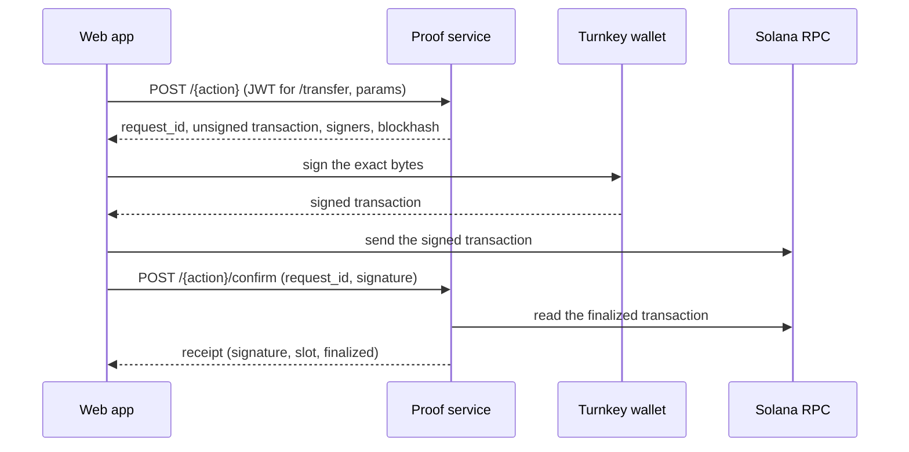

# API contract for the web app

Issue [#63](https://github.com/Dnreikronos/cadence/issues/63). This is what the
web app builds and mocks against (#79), so the frontend and the proof service
agree on one shape before the remaining routes exist.

**Status: working draft, nothing here is fixed.** The frontend wrote this so it can
keep building screens against mocks while the backend routes do not exist. The
backend owner is free to change any 🟡 proposal, including its shape, path or error
codes; when that happens the client and the mocks follow, and this file is updated.
Merging it is not a sign-off. Every route is marked:

- ✅ **Implemented.** Described from [`WRAP_API.md`](WRAP_API.md),
  [`TRANSFER_API.md`](TRANSFER_API.md) and `services/proof/src`. Changing these is a
  breaking change.
- 🟡 **Proposed.** The route does not exist yet. The shape below is the
  frontend's request, derived from the open issue that will build it. It is a
  starting point, not a commitment, and the questions that need an answer are
  collected in [Open questions](#open-questions).

A client and a mock service (#110) already implement the shapes of the proposed
routes as written below, and every screen of the web app is built on them (see
[`frontend/README.md`](../../frontend/README.md#screens)). Problems found in those
shapes are therefore recorded in
[Design review findings to resolve before building](#design-review-findings-to-resolve-before-building)
as proposals, not applied silently to the shapes.

Last synced with the client and the mock on 2026-10-04 (see
[Revisions](#revisions)). Where this file says what "the web app" or "the mock"
does, it means `frontend/src/lib/api` (`schemas.ts`, `client.ts`, `errors.ts`,
`sign.ts`, `mocks/handlers.ts`) and the flows under `frontend/src/lib` at that date.
Where the mock does something a real service might not, it is listed in
[Mock deviations](#mock-deviations) so nobody builds on it. What the screens
assume without the backend having said so is in
[What the frontend assumes from the backend](#what-the-frontend-assumes-from-the-backend).

Nothing here changes a confidential-transfer rule. The user's wallet signs every
transaction that moves the user's funds, and no customer wallet signing key reaches
Cadence (ADR B9). No off-chain store holds a readable amount (ADR B12). Three
details are easy to over-read, so they are stated exactly:

- The ✅ routes sign and submit nothing. A Cadence fee payer (#66, 🟡) would
  **co-sign** as fee payer; #66 itself asks to record that as a clarification of B9
  ("no _customer_ signing key reaches our infrastructure").
- The browser does not hold a viewing key, but the service does. Proof generation
  runs server-side and Cadence holds customers' ElGamal secrets in Vault (ADR B17).
- Two values the browser sends are key-equivalent and must be handled like
  secrets: the `aes_key` on `/transfer`, and the key-derivation signature on
  `/keys/enroll` (the signature derives both the ElGamal and the AES key).

## Conventions

| Topic            | Rule                                                                                                                                                                                                                                                                                                                                                                                                                                                                                                                                                                                                                                                                                                                                                                                                                                                                                                                                                                                                                                                                                                                   |
| ---------------- | ---------------------------------------------------------------------------------------------------------------------------------------------------------------------------------------------------------------------------------------------------------------------------------------------------------------------------------------------------------------------------------------------------------------------------------------------------------------------------------------------------------------------------------------------------------------------------------------------------------------------------------------------------------------------------------------------------------------------------------------------------------------------------------------------------------------------------------------------------------------------------------------------------------------------------------------------------------------------------------------------------------------------------------------------------------------------------------------------------------------------- |
| Base URL         | The web app reads `NEXT_PUBLIC_API_MODE` (`mock` or `real`) and, in real mode, `NEXT_PUBLIC_PROOF_API_URL`, which must be https unless it points at localhost, because the bearer token and the confidential keys travel in the requests. The service is a separate origin, so CORS applies (next row). In mock mode the base URL is the fixed origin `http://mock.cadence.test`, answered in the browser by MSW.                                                                                                                                                                                                                                                                                                                                                                                                                                                                                                                                                                                                                                                                                                      |
| CORS             | `PROOF_CORS_ORIGINS` defaults to `*` when unset (any origin, no credentials). An explicitly empty value disables cross-origin access. Otherwise it is a comma-separated list of exact origins. Allowed methods are **GET and POST only**. Allowed request headers are `Content-Type` and `Authorization`. Preflight is cached for 600 s (`cors.rs:13-43`). `PUT`, `PATCH` and `DELETE` fail preflight today.                                                                                                                                                                                                                                                                                                                                                                                                                                                                                                                                                                                                                                                                                                           |
| Format           | JSON in and out, `Content-Type: application/json`. Bodies are limited to 8 KiB by a `DefaultBodyLimit` on the wrap and transfer routers and to 32 KiB on the runs router (not on `/health`). An oversize body, a missing or wrong `Content-Type`, malformed JSON, a wrong field type and an unknown field all return `400 invalid_request`. The service never returns 413 or 415. The web app sends `Content-Type` only when a request has a body: the 🟡 `POST` routes that take none (revoke, retry, invite) send none (see question 34).                                                                                                                                                                                                                                                                                                                                                                                                                                                                                                                                                                            |
| Amounts          | **Integer base units as a decimal string**, six decimals: `"1000000"` is 1 USDC. Never a JSON number (that is `400 invalid_request`), never `"1.5"`. The server accepts 1 to 15 ASCII digits whose value is `1` to `2^48 - 1` (`281474976710655`); an empty string, more than 15 characters, a non-digit, `0` or a larger value is `400 invalid_amount`. The server accepts leading zeros today (`"0001"` is 1). The web app is stricter on purpose and never sends them. The web app converts at the edge with exact integer math and never uses floats for money.                                                                                                                                                                                                                                                                                                                                                                                                                                                                                                                                                    |
| Identifiers      | `request_id` is 64 **lowercase** hexadecimal characters, the SHA-256 of the transaction wire bytes (uppercase is `400 invalid_request_id`). `company_wallet` must be a base58 public key that is on the ed25519 curve. Other wallet and account fields are base58 public keys. Signatures are base58 transaction signatures. Ids of runs, payments, people, auditors and companies, and `idempotency_key`, are UUIDs (the client accepts any GUID shape).                                                                                                                                                                                                                                                                                                                                                                                                                                                                                                                                                                                                                                                              |
| Time             | RFC 3339 UTC.                                                                                                                                                                                                                                                                                                                                                                                                                                                                                                                                                                                                                                                                                                                                                                                                                                                                                                                                                                                                                                                                                                          |
| Cluster          | Devnet only today. On another cluster `/wrap` and `/wrap/confirm` fail with `wrap_requires_devnet`. Only `/transfer` and `/transfer/confirm` remap it to `transfer_requires_devnet` (`client.rs:68`, `transfer.rs:335-340`).                                                                                                                                                                                                                                                                                                                                                                                                                                                                                                                                                                                                                                                                                                                                                                                                                                                                                           |
| Rate limits      | Fixed 60 s windows, held in memory per service instance and reset on restart. The wrap routes and the transfer routes each have their own limiter, so a wrap call does not spend transfer quota. Per window and limiter: 120 requests in total, 30 per direct socket peer, and (prepare only) 10 per `company_wallet`. Forwarded IP headers are ignored, so behind a proxy all users share the proxy's peer quota. These are **not** windows: at most 8 requests in flight per limiter, and on `/transfer` at most 4 proof workers. Every limit returns `429` with `Retry-After: 60` and the route's `wrap_rate_limited` or `transfer_rate_limited` code, concurrency caps included. A confirm call spends the same peer and global quota as a prepare call, so polling uses budget. The runs routes use the transfer codes, have their own 120 and 30 per window and share the four proof workers with `/transfer` (see [`RUNS_API.md`](RUNS_API.md)). `/transfer` and `/transfer/confirm` also give up after 30 s with `503 transfer_timeout` (`wrap_limits.rs:41-115`, `transfer.rs:89`). `/health` is not limited. |
| `Retry-After`    | CORS sets no `expose_headers`, and `Retry-After` is not a CORS-safelisted response header, so cross-origin browser code reads `null` for it. Until the backend exposes it, the web app waits a fixed 60 s on any `429` whose `Retry-After` it cannot read (60 is the only value the service sends) and does not auto-retry in a loop: `ApiError.retryAfter` is 60 then, or the header's value when it is readable (the mock sends it from the same origin, so it is readable there only). **Backend request:** add `Access-Control-Expose-Headers: Retry-After`.                                                                                                                                                                                                                                                                                                                                                                                                                                                                                                                                                       |
| Caching          | `Cache-Control: no-store` on every response that carries an amount. The web app fetches every request, downloads included, with `cache: "no-store"` and keeps amounts in memory only (React Query's cache; nothing is written to `localStorage`, and the persisted submission records hold no amount). The service sets no `Cache-Control` on any route today (the only response header it sets itself is `Retry-After`), so this is a backend request.                                                                                                                                                                                                                                                                                                                                                                                                                                                                                                                                                                                                                                                                |
| Request checks   | The client parses every request body with a strict schema before it leaves the browser, so an unknown field or a malformed value throws in the browser and nothing is sent. Amounts: `1` to `2^48 - 1`, digits only, no leading zero (a read may be `"0"`). Wallets, accounts and `company_wallet`: base58, 32 to 44 characters; the curve is not checked. Request signatures (`signature`, `wallet_signature`): base58, 43 to 88 characters. `request_id`: 64 lowercase hex. `aes_key`: base64 of exactly 16 bytes (22 characters, a last one of `A`, `Q`, `g` or `w`, then `==`). `setup` artifacts: base64. A path segment that is not a GUID is refused before the call, so `..` or `/` never reaches a path. Responses are checked too: one that does not match its schema is a `ContractError`, not an `ApiError`.                                                                                                                                                                                                                                                                                               |
| Retryable errors | `ApiError.isRetryable` is true for `transaction_not_finalized`, any `429`, `502` to `504` (so `503` too) and `network_error` (the browser could not reach the server). It is false for `500`, every other `4xx` and a `ContractError`. Confirm polling and the screens' "Try again" use that one flag. React Query retries a failed read once, and never a `4xx`.                                                                                                                                                                                                                                                                                                                                                                                                                                                                                                                                                                                                                                                                                                                                                      |
| Compatibility    | Additive only. See [Evolving the contract](#evolving-the-contract).                                                                                                                                                                                                                                                                                                                                                                                                                                                                                                                                                                                                                                                                                                                                                                                                                                                                                                                                                                                                                                                    |

### Authentication ✅ for `/transfer`, 🟡 for everything else

Send the Supabase session's access token:

```http
Authorization: Bearer <Supabase access token>
```

The service verifies it on every call by asking Supabase Auth
(`GET {PROOF_SUPABASE_URL}/auth/v1/user` with the project's public API key). It
accepts a token of at most 8,192 bytes and uses the returned user UUID, in
canonical lowercase form, as the caller's identity. It never trusts a claim in
the token body.

- A missing, malformed or rejected token is `401 authentication_required`.
- If Supabase Auth cannot be reached, the call fails with
  `503 auth_unavailable`. The client treats that as retryable and does **not** sign
  the user out.
- The web app refreshes the session in the browser as usual and sends the
  current token. It does not forward the refresh token. It reads the token from
  the browser's Supabase session on every call; with no session it fails with
  `authentication_required` without sending anything. In mock mode the token is the
  fixed string `mock-token`, and the mock only checks that some `Bearer` value is
  present. Nothing in the client signs the user out on an API error: a `401` shows
  "Your session ended" and the route guard decides the rest.
- **Order of checks on `/transfer` and `/transfer/confirm`.** Rate limits come
  first. Then body validation (`400`) and `503 transfer_unavailable` (the routes are
  not configured) run **before** the token check. An unauthenticated, malformed
  request therefore gets `400`, not `401`, and an unauthenticated request to an
  unconfigured service gets `503`, not `401` (`transfer.rs:129-152`,
  `transfer.rs:274-291`).

**Wallet association (✅).** The first `/transfer` for a wallet carries
`wallet_signature`, a signature over exactly these UTF-8 bytes with no trailing
newline:

```text
Cadence wallet association
user:<verified Supabase user UUID, lowercase>
wallet:<company_wallet>
```

Later calls omit it. A wallet cannot be reassigned, and another user cannot claim
an existing link (`wallet_access_denied`). A call without a link and without the
signature is `409 wallet_link_required`. A `wallet_signature` that does not parse
or does not verify is also `403 wallet_access_denied` (`transfer_store.rs:55-59`),
and so is a `sender` account the wallet does not own (see
[Transfer](#transfer-one-confidential-payment-)). This is a different message from
the key-derivation message; the two are never interchangeable.

**Roles (🟡).** Routes under `/me`, `/company` and `/audit` authorize from the
caller's `memberships` row (admin, recipient or auditor, one company each). The
web app's route guard only chooses which page to show. The service enforces the
role itself on every call and reads it from the database each time. The browser
reads Postgres directly under row-level security, which is why ADR B13 makes RLS
the boundary for those tables. These service routes are different: the service
connects with its own database roles, whose policies are `USING (true)`
(`20261003000000_transfer_requests.sql:39-44`), and it scopes every query by
`user_id` itself (`transfer_store.rs:106-121`). For these routes the service's own
checks are the authorization boundary. A caller reaching a route outside their role
gets `403 forbidden_role`; a resource in another company is `404`, never `403`, so a
response never confirms that it exists.

`/wrap` and `/wrap/confirm` (✅) currently accept calls without a user token. The
proposal is to require the same bearer token as `/transfer` before the web app
ships them (see [Open questions](#open-questions)).

## Errors

Every error from a route is a fixed JSON object:

```json
{ "error": "<stable_code>" }
```

The only exceptions are routing errors: an unknown path is `404` and a wrong method
is `405`, both with an empty body, because no fallback handler is registered
(`lib.rs:56-61`).

- The code is the contract. The message shown to people is written by the web app
  per code, so copy can change without a backend release.
- **No error ever contains an amount, a key, a token, a signature or any value from
  the request.** Rejected JSON cannot echo what was sent.
- Statuses are fixed per code: `400` malformed, `401` unauthenticated, `403` not
  allowed, `404` unknown (or, for `/transfer/confirm`, not yours), `409` a rule or
  chain state conflicts, `429` rate limited, `500` `internal_error`, `503` a
  dependency is down.
- The client only branches on the code and treats any unknown code as its status
  class, so adding codes later is not breaking. A body that is not `{ "error": ... }`
  gets the same treatment: `401` is `authentication_required`, `403` `forbidden`,
  `404` `not_found`, `429` `rate_limited`, `500` and above `service_unavailable`,
  anything else `request_failed`.

### Codes in use ✅

| Status | Codes                                                                                                                                                                                                                                                                                                                                                                                                                                                                                                                                                                                                                                                                                                                                                                                                       |
| ------ | ----------------------------------------------------------------------------------------------------------------------------------------------------------------------------------------------------------------------------------------------------------------------------------------------------------------------------------------------------------------------------------------------------------------------------------------------------------------------------------------------------------------------------------------------------------------------------------------------------------------------------------------------------------------------------------------------------------------------------------------------------------------------------------------------------------- |
| 400    | `invalid_request`, `invalid_account`, `invalid_wallet`, `invalid_amount`, `invalid_transfer`, `invalid_balance_key`, `invalid_request_id`, `invalid_signature`, `invalid_confidential_setup`, `invalid_payments`, `invalid_payment`, `invalid_run_id`                                                                                                                                                                                                                                                                                                                                                                                                                                                                                                                                                       |
| 401    | `authentication_required`                                                                                                                                                                                                                                                                                                                                                                                                                                                                                                                                                                                                                                                                                                                                                                                   |
| 403    | `wallet_access_denied`                                                                                                                                                                                                                                                                                                                                                                                                                                                                                                                                                                                                                                                                                                                                                                                      |
| 404    | `transfer_not_found`, `wrap_not_found`, `run_not_found`                                                                                                                                                                                                                                                                                                                                                                                                                                                                                                                                                                                                                                                                                                                                                     |
| 409    | `wrap_requires_devnet`, `transfer_requires_devnet`, `wallet_link_required`, `sender_account_missing`, `recipient_account_missing`, `invalid_sender_account`, `invalid_confidential_state`, `proof_generation_failed`, `transaction_not_finalized`, `transaction_failed`, `transaction_mismatch`, `transfer_already_confirmed`, `wrap_already_confirmed`, `confidential_setup_required`, `wrapped_mint_missing`, `invalid_wrapped_mint`, `usdc_source_missing`, `invalid_usdc_source`, `insufficient_usdc`, `invalid_wrap_destination`, `confidential_destination_unavailable`, `confidential_key_mismatch`, `runs_requires_devnet`, `outstanding_payments`, `original_signature_required`, `transaction_history_unavailable`, `payment_already_resolved`, `payment_attempt_changed`, `payment_not_prepared` |
| 429    | `transfer_rate_limited`, `wrap_rate_limited` (both with `Retry-After: 60`)                                                                                                                                                                                                                                                                                                                                                                                                                                                                                                                                                                                                                                                                                                                                  |
| 500    | `internal_error`                                                                                                                                                                                                                                                                                                                                                                                                                                                                                                                                                                                                                                                                                                                                                                                            |
| 503    | `transfer_unavailable`, `auth_unavailable`, `key_storage_unavailable`, `transfer_storage_unavailable`, `wrap_storage_unavailable`, `rpc_unavailable`, `transfer_timeout`, `run_storage_unavailable`                                                                                                                                                                                                                                                                                                                                                                                                                                                                                                                                                                                                         |

Which route emits what, where it is not obvious:

- Wrap routes only: `wrap_requires_devnet`, `wrap_not_found`,
  `wrap_already_confirmed`, `wrap_storage_unavailable`, `wrap_rate_limited` (all
  wrap routes); `invalid_confidential_setup`, `confidential_setup_required`,
  `confidential_destination_unavailable`, `confidential_key_mismatch`,
  `invalid_wrap_destination`, `usdc_source_missing`, `invalid_usdc_source`,
  `insufficient_usdc` (`/wrap` only). `wrap_not_found` and
  `wrap_already_confirmed` come from `/wrap/confirm`.
- `/wrap` reports a malformed or off-curve `company_wallet` as `invalid_wallet`
  and never emits `invalid_account`. `/transfer` emits `invalid_account` for a
  `company_wallet`, `sender` or `recipient` that is not base58, and `invalid_wallet`
  for a `company_wallet` that is off the curve.
- `invalid_transfer` is `sender` equal to `recipient`. `invalid_sender_account` is
  a `sender` account whose data cannot be read as a token account.
- `invalid_signature` is confirm-only and means the signature does not parse or is
  all zeros. A wrong or forged signature on a well-formed confirm is
  `transaction_mismatch`, and a bad `wallet_signature` on `/transfer` is
  `wallet_access_denied`.
- `wrapped_mint_missing` and `invalid_wrapped_mint` are deployment problems the
  user cannot fix. Both routes can return them.
- `internal_error` covers configuration and transaction-assembly failures
  (`error.rs:36-81`).

### Codes this contract adds 🟡

Statuses and routes are part of the proposal.

| Status | Code                                      | Where                                                                                                                                                                                                                                                                                                 |
| ------ | ----------------------------------------- | ----------------------------------------------------------------------------------------------------------------------------------------------------------------------------------------------------------------------------------------------------------------------------------------------------- |
| 403    | `forbidden_role`                          | Any `/me`, `/company`, `/audit` route called outside the caller's role.                                                                                                                                                                                                                               |
| 404    | `run_not_found`                           | The mock's `GET /runs/:run_id`, when the run is not the caller's (the implemented service has the code too, see [Codes in use](#codes-in-use-)).                                                                                                                                                      |
| 404    | `payment_not_found`                       | `POST /runs/:run_id/payments/:payment_id/confirm` and `/retry`, when the payment is not in that run.                                                                                                                                                                                                  |
| 404    | `person_not_found`                        | `POST /runs`, `PUT /company/people/:person_id/amount` and `POST /company/people/:person_id/invite`, when `person_id` is not in the caller's company.                                                                                                                                                  |
| 404    | `auditor_not_found`                       | `POST /company/auditors/:auditor_id/revoke`, when the id is not an auditor or pending invite of the caller's company.                                                                                                                                                                                 |
| 409    | `recipient_not_activated`                 | `POST /runs` and the retry route, for a person without an activated account.                                                                                                                                                                                                                          |
| 409    | `reveal_risk_not_acknowledged`            | `POST /unwrap`, see [Unwrap](#unwrap-private-usdc-to-public-with-the-reveal-risk-flag-).                                                                                                                                                                                                              |
| 409    | `credit_counter_mismatch`                 | `POST /accounts/apply-pending/confirm`. It can come for an apply that did land: see [Accounts](#accounts-configure-and-apply-pending-).                                                                                                                                                               |
| 409    | `key_already_enrolled`                    | `POST /keys/enroll`.                                                                                                                                                                                                                                                                                  |
| 409    | `person_already_active`, `person_removed` | `POST /company/people/:person_id/invite`, see [Invites](#invites-).                                                                                                                                                                                                                                   |
| 409    | `auditor_already_invited`                 | `POST /company/auditors`, for an address with a pending invite, see [Auditors](#auditors-).                                                                                                                                                                                                           |
| 409    | `auditor_already_active`                  | `POST /company/auditors`, for an address that already audits the company.                                                                                                                                                                                                                             |
| 429    | `rate_limited`                            | The auditor, access log and account status routes, with `Retry-After: 60`. They are not payments, so they do not use `wrap_rate_limited` or `transfer_rate_limited`. Which code the other reads answer with is not decided (the mock uses `rate_limited`; `POST /runs` uses `transfer_rate_limited`). |

The review findings below propose three more (`run_in_progress`,
`idempotency_key_reused`, `invalid_cursor`); they are not part of the shapes yet. The
mock also emits a few codes that are in neither list; they are under
[Mock deviations](#mock-deviations), and nothing may depend on them.

### Evolving the contract

- The client ignores unknown fields in a response (request bodies are strict, see
  [Conventions](#conventions)). Five enums are tolerant, each read as its safest
  class:
  - an unknown `reveal_risk.level` parses as `exact` (the warning is shown);
  - an unknown error code is handled as its status class;
  - an unknown auditor `status` is shown as a pending invite, so the auditors screen
    never claims access. The sentences that name who can read amounts count it as a
    reader instead, so they never leave one out;
  - an unknown access-log `actor.kind` or `action` is shown as sent, as plain text;
  - an unknown payment or run-payment `status` parses (any non-empty string). Lists
    and pills show a payment item as `pending`; a run row shows it as "Unknown",
    offers no retry, sign again or pay again, and the run is read a bounded number of
    times more. The 24-hour repay guard treats it as possibly paid: only `failed`, and
    `pending` with no signature, leave a person ticked by default, so a status the service
    adds for a payment that landed (`finalized`, say) cannot lead to a second payment.
- Changes are additive: new fields, codes, enum values and routes may appear.
  Removing or renaming a field, changing a type or a meaning, or changing a code's
  status is a breaking change and needs a new route or a version prefix, announced
  in [Revisions](#revisions).
- Proposal: add an `api_version` integer to the `/health` response so the web app
  can show "update required" instead of failing on a shape it does not know. The
  health shape today has no such field.

## Prepare, sign, confirm

Every action that moves funds uses the same three steps. The service builds an
unsigned transaction, the user's wallet signs and submits it, and the service
verifies what landed. **Today the ✅ routes sign and submit nothing.** A Cadence
fee payer would co-sign (🟡, #66). Having the service submit a transaction the user
already signed is a separate open question, and it is not signing, so it does not
touch ADR B9.



### Prepare response ✅

All prepare routes return the same core fields, plus route-specific ones:

```json
{
  "request_id": "<64-character hash>",
  "transaction": "<base64 unsigned wire transaction>",
  "transaction_version": 1,
  "required_signers": ["<base58 public key>"],
  "recent_blockhash": "<blockhash>",
  "last_valid_block_height": 123
}
```

- `transaction` is the exact wire bytes. The web app base64-decodes it, hands the
  bytes to the signer and signs **unchanged**. It never edits the message,
  replaces the blockhash or adds instructions: confirmation is bound to that
  message, and a changed one fails with `transaction_mismatch`.
- `transaction_version` is `0` for `/wrap` and `1` for `/transfer` and `/runs`. The signer must
  support the version it is given. Extension wallets do not sign version 1 yet, so
  every user signs through a Turnkey embedded wallet (#77). Never fall back to
  signing the bytes as a message.
- `required_signers` lists every key that must sign, in the order the service
  expects. Today it holds only the company wallet. The web app signs only for keys
  it controls and **fails loudly if it is asked to sign for a key that is not the
  user's wallet** (see [Open questions](#open-questions) on a service fee payer,
  #66): `signAndConfirm` throws `UnexpectedSignerError` before anything is signed
  when `required_signers` is empty or holds any key other than the signer's address.
  Any `transaction_version` other than `0` or `1` is a contract error.
- Returning bytes does not move funds. Signing is the authorization.

**The Signer.** The web app needs two things from the user's wallet, and nothing
else (`Signer` in `sign.ts`):

- `signTransaction(bytes)` signs the exact wire bytes and returns the signed wire
  bytes. Required.
- `signMessage(bytes)` returns a 64-byte ed25519 signature. **Optional**: a wallet
  that cannot sign messages omits it, and activation then stops with "the wallet
  cannot sign messages". It is used for the key-derivation message only. Transaction
  bytes are bytes too, so a real signer must refuse anything that is not that
  canonical message: signing arbitrary bytes here would be signing a transaction
  without `signTransaction`'s checks. The embedded-wallet spike found Phantom
  rejecting the real message's bytes, so the real message is untested
  ([spike](spikes/2026-10-03-embedded-wallet.md)).
- `submit(signedBytes)` sends the signed bytes to Solana and returns the signature.
  It belongs to the wallet object, not to the `Signer`.

### Confirm ✅

```json
{
  "request_id": "<from prepare>",
  "signature": "<submitted transaction signature>"
}
```

Success returns the receipt, and a repeat with the same signature returns the same
receipt:

```json
{
  "request_id": "<id>",
  "signature": "<signature>",
  "slot": 123,
  "status": "finalized"
}
```

- The service reads the transaction at finalized commitment with
  `maxSupportedTransactionVersion: 1`, and records a receipt only if execution
  succeeded, the message matches what it prepared, and the wallet's signature
  verifies.
- `409 transaction_not_finalized` means "not yet". The service returns it whenever
  the finalized read finds nothing, so it also covers a signature that was never
  submitted or has been dropped. The web app retries `/confirm` with a short
  backoff (2 s, growing by half each time to 10 s) for up to 60 s counted from the
  submit, showing "Waiting for the network", and then stops with a timeout that
  carries the signature (`ConfirmTimeoutError`) and offers a manual check. It
  retries on the retryable errors in [Conventions](#conventions) (`429`, `502` to
  `504`, a dropped connection), waiting at least `Retry-After` when it can read it.
  Any other failure of `/confirm` (a `500`, an unreadable body) ends the polling and
  counts as "may have been sent" (see
  [The sent-failure rule](#the-sent-failure-rule)). It does not prepare a second
  transaction while one may still land.
- `409 transaction_failed` means the transaction with that signature executed with
  an error. `409 transaction_mismatch` means the transaction with that signature is
  not the prepared message, or its signature does not verify for the wallet. Both
  are final **for that signature**, not for the `request_id`: the record stays
  unsigned, so the genuine signature can still confirm it. In practice the user
  starts again from prepare.
- A different signature for a request that already has a receipt is
  `409 transfer_already_confirmed` (`/transfer/confirm`) or
  `409 wrap_already_confirmed` (`/wrap/confirm`).
- **`/transfer/confirm` only:** another user's `request_id` is `404
transfer_not_found`, because transfer records are looked up by `request_id` and
  `user_id`. **`/wrap/confirm` has no user:** a wrap record is looked up by
  `request_id` alone, and anyone holding an id may confirm it. That only records
  the public fact that the wallet's own signed transaction landed
  (`wrap_store.rs:144-158`).

### Expiry and retries

- A prepared transaction expires with its blockhash (`last_valid_block_height`).
  After expiry the web app prepares again; it never reuses expired bytes. It
  prepares again only when nothing was sent (a failure before the submit, a refused
  signature) or the network answered `transaction_failed`; otherwise see the
  sent-failure rule below. The one reuse: a payroll payment whose signature the
  person cancelled sent nothing, so the same unsent transaction is signed again
  ("Sign again"), only within about 90 s of being prepared and never after a failure
  past the submit; older than that, or after a reload, it is prepared again or a new
  run is started.
- A transaction may have landed even if the browser lost the response.
  **Before preparing a replacement for a payment that was already submitted,**
  reconcile: confirm the earlier `request_id` first. Preparing a fresh deposit
  or payment on top of one that landed pays twice.
- **Reconciling a wrap or an apply.** The web app asks again with the saved
  `request_id` and signature (idempotent for one signature, so it prepares nothing),
  every 3 s and at least `Retry-After`. `200` is `confirmed`. `transaction_failed` is
  `failed`. Any other non-retryable answer, including `404 wrap_not_found`, is
  `unknown`, never `failed`. `transaction_not_finalized` is only conclusive with
  time: once 90 s have passed since the send (a blockhash lives up to about 90 s, and
  the finalized read can lag by about 13 s) and the service said "not finalized" at
  least once, the transaction is read as `failed` and a new one may be prepared. A
  record with no signature, or a service that never answered, is `unknown` after
  90 s. The 90 s is a clock, not a block height: `last_valid_block_height` is stored
  but not read yet, which is an assumption (question 28).

- **Wrap records are deleted.** The service removes unsigned wrap records whose
  blockhash has expired and that are more than 24 hours old
  (`20260930000001_wrap_cleanup.sql`). Confirming the earlier `request_id` after
  that can return `404 wrap_not_found`, and that is **not** evidence that the
  deposit failed ([`WRAP_API.md`](WRAP_API.md)). Reconcile by the chain
  signature, and confirm within 24 hours. Confirmed receipts are never deleted.
  Transfer records have no cleanup job.
- **`request_id` is not a stable key for a payment.** It is the SHA-256 of the wire
  bytes. For `/wrap`, two preparations produce the same `request_id` only when they
  get the same blockhash, and then they cannot erase an earlier confirmation. Each
  `/transfer` prepare yields a new `request_id`, because the proofs are randomized.
  It also costs a Vault key read, a decryption audit row and one of the wallet's 10
  prepares per minute, so the client does not prepare "just to check".

#### The sent-failure rule

From the moment signing hands over to submitting, the transaction may be on the
network, even if `submit` throws and even if confirming answers with something
unreadable. **After the transaction may have been broadcast, the web app never
prepares a replacement; it can only re-confirm with the saved signature.** With no
signature it can only tell the person to check the balance and the history. The one
exception is `transaction_failed`: the network ran the transaction and refused it,
so nothing moved. Every flow that moves money applies the rule, but they do not keep
the evidence equally:

| Flow                                    | After "may have been sent"                                                                                                                                                                                                                   | Evidence kept across a reload                                                    |
| --------------------------------------- | -------------------------------------------------------------------------------------------------------------------------------------------------------------------------------------------------------------------------------------------- | -------------------------------------------------------------------------------- |
| Deposit, wrap step (`/company/deposit`) | no new wrap until the earlier one is reconciled; "Check my balances"                                                                                                                                                                         | yes: a submission record in `sessionStorage` (this tab)                          |
| Deposit, apply step                     | past "signing", every failure except `transaction_failed` is sent: no retry; "Check my balances", and "Check again" (re-confirms the saved signature) when there is one                                                                      | no: kept in memory for the screen only                                           |
| Apply pending (`/me`)                   | no retry; the button locks while the saved signature is re-confirmed; "Check my balance", "Check again"                                                                                                                                      | yes: a submission record                                                         |
| Withdraw (`/me/withdraw`)               | no retry, and the same amount is held back until the page is reloaded                                                                                                                                                                        | **no**: the held amounts live in the mutation cache, and signing out clears them |
| Payroll payment (`/company/runs/...`)   | that payment is never retried or signed again; "Check again" re-confirms with its signature, and a payment with no signature only says to check the company's payments and balance. A cancelled signature (nothing sent) may be signed again | **no**: signatures live in component state                                       |
| Activation, account step (`/activate`)  | the next try settles the saved transaction instead of preparing a second one                                                                                                                                                                 | no: an in-memory map per wallet                                                  |

A submission record is `{ kind, request_id, signature | null, last_valid_block_height,
wallet, at }`, one per kind, under `cadence:submission:<kind>` in `sessionStorage`
(`frontend/src/lib/submissions.ts`). It holds no secret and no amount, is written just
before `submit` runs (signature `null`) and updated when the network returns the
signature, and is cleared once the outcome is final. **Persisting a submission for
withdraw and for payroll is not done yet. It is a prerequisite for real signing**: a
reload or a closed tab today forgets a transaction that may have landed, and a
payroll payment that was not signed in the session that created its run cannot be
signed later at all (nothing returns its transaction again).

## Routes

### Health ✅

`GET /health` needs no authentication and is not rate limited. It returns
`{ "status": "ok", "build_sha": "<sha>", "rpc_reachable": true }` with `200`, or
`status: "unavailable"` and `rpc_reachable: false` with `503` when the Solana RPC
cannot be reached (`health.rs:12-25`). The client has `api.health()`, which returns
the body of a `503` instead of throwing, but **no screen calls it yet**: there is no
service-status banner.

### Wrap: public USDC to private ✅

`POST /wrap`, then `POST /wrap/confirm`. Used by the Deposit screen (#82).

```json
{ "company_wallet": "<wallet public key>", "amount": "1000000" }
```

Add `setup` when the destination account is not configured yet, with the two
public activation artifacts (`pubkey_validity_proof`, `decryptable_zero_balance`,
both base64). If the account is already configured, omit it.

The prepare response adds `destination` (the Token-2022 account), `mint` and
`deposit_state: "pending_after_confirmation"`. The wrapped amount lands in the
**pending** balance. It is only spendable after the owner applies it with
`POST /accounts/apply-pending`, which is 🟡 proposed (#68) and does not exist yet:
today no service route applies pending credits. The web app must not call the
deposit "available" before that step: the Deposit screen runs the wrap, then the
apply, and says the deposit is private only after both. A deposit is public by
design.

The Deposit screen never sends `setup`, and no screen builds the two activation
artifacts. A company wallet that is not configured yet therefore ends in
`409 confidential_setup_required`, which the screen shows as "Your wallet needs
activating first … that step isn't available from this screen yet", with no link to
anywhere (see question 30). The screen checks the wallet's plain USDC against the
amount before it asks (a chain read of the associated token account, not a service
call); the mock also refuses at prepare, see
[Mock deviations](#mock-deviations).

Errors that matter to the UI:

- `400 invalid_wallet`, `400 invalid_amount`, `400 invalid_confidential_setup` (the
  `setup` artifacts do not decode or the proof does not verify).
- `409 confidential_setup_required` (send the activation flow).
- `409 usdc_source_missing` (the wallet has no USDC account),
  `409 invalid_usdc_source`, `409 insufficient_usdc`.
- `409 invalid_wrap_destination` (the destination exists but is not the expected
  account), `409 confidential_destination_unavailable` (it cannot accept another
  pending credit), `409 confidential_key_mismatch` (`setup` was built for a
  different ElGamal key than the configured account).
- `409 wrapped_mint_missing`, `409 invalid_wrapped_mint` (deployment problems),
  `409 wrap_requires_devnet`.
- On confirm: `404 wrap_not_found`, `409 wrap_already_confirmed`, and the
  transaction codes in [Confirm](#confirm-).

### Transfer: one confidential payment ✅

`POST /transfer`, then `POST /transfer/confirm`.

```json
{
  "company_wallet": "<wallet public key>",
  "sender": "<source Token-2022 account>",
  "recipient": "<destination Token-2022 account>",
  "amount": "4200000000",
  "aes_key": "<base64 16-byte AES balance key>",
  "wallet_signature": "<base58, first request only>"
}
```

`sender` and `recipient` are token accounts, not wallets. The response is the
standard prepare response with `transaction_version: 1`, plus `sender`,
`destination` and `mint`. Only the company wallet signs. The client implements it
(`api.transfer`, with `aes_key` and `wallet_signature` checked as in
[Conventions](#conventions)), but **no screen calls it**: payroll goes through
`/runs`, so nothing in the web app sends an `aes_key` today (the implemented
`/runs` needs one, see [Payroll run](#payroll-run-one-approval-many-recipients-)).

A `sender` that is not a Token-2022 account owned by `company_wallet` on the wrapped
mint is `403 wallet_access_denied`, not a 409 (`transfer.rs:172-180`). Both accounts
must already be configured for confidential transfers, the sender's key must be
enrolled in Vault, and credits must already be applied to the sender's available
balance.

> The `aes_key` field is how the service learns the sender's balance key today.
> It must never be logged, stored by the web app or sent to analytics. Vault does
> not hold the AES key at all, so the service cannot read it from there today; see
> [finding 2](#design-review-findings-to-resolve-before-building) and
> [Open questions](#open-questions).

🟡 **Proposed, not implemented (#60).** A payment that falls back to an ordinary
transfer would be flagged `transparent` in the read routes below, so the UI can
show the "Transparent" badge. Nothing in `services/proof` implements a fallback
today; the `transparent` fields in this document describe a proposal. See
[finding 7](#design-review-findings-to-resolve-before-building) on consent.

### Payroll run: one approval, many recipients ✅

For the headline flow (#55, #83). One confirmation by the admin, then one signature
per recipient.

**The backend has implemented `/runs` (#55), and not in the shape this draft
proposed.** [`RUNS_API.md`](RUNS_API.md) and `services/proof/src` are the source of
truth for the routes. The web app's client and mock still implement the proposal
that follows under "The shape the client and mock implement", so **today the client
cannot call the implemented routes**: its strict request body (`person_id`,
`idempotency_key`, no `sender`, no `aes_key`) would be refused, and its per-payment
confirm and retry routes do not exist. Reconciling them is open work (questions 36
and 37).

What is implemented, in short (read `RUNS_API.md` for the rest):

- `POST /runs` takes `company_wallet`, `sender` (the source token account), the
  transient `aes_key`, `wallet_signature` (first request only) and 1 to 100 distinct
  `payments` of `{ recipient, amount }`, where `recipient` is a **token account**, not
  a person. It uses the transfer authentication and wallet association, and returns
  the run with one unsigned v1 transaction per payment that could be built, each
  identified by its `position`. A payment that cannot be prepared (a missing or
  unusable recipient, a proof failure) comes back as `preparation_failed` with a fixed
  error and no transaction; the others are still prepared.
- Each payment's proofs assume the ones before it succeeded, so the wallet signs and
  submits them in ascending `position`, waiting for finalized execution each time. If
  one fails, the later transactions are stale and must not be sent.
- `POST /runs/:id/confirm` takes any subset of up to 100 positions as
  `{ position, request_id, signature }` and records each receipt on its own; per-item
  problems come back in an optional `errors` list.
- `POST /runs/:id/retry` takes the `aes_key` again, the intended `amount` of each
  position to rebuild and, for every attempt whose blockhash has not expired, its
  original wallet signature. It keeps finalized payments, rebuilds the unpaid ones
  against fresh sender state in the same run, and increments `attempt`. A run is never
  restarted for a recipient who might already be paid.
- `GET /runs/:id` returns the ordered metadata (`position`, `destination`, `attempt`,
  `request_id`, `status`, `signature`, `slot`, `error`), no amounts and no transaction
  bytes. Another user's run is `404 run_not_found`. Payment `status` is `prepared`,
  `finalized`, `failed`, `expired` or `preparation_failed`; the run's is `prepared`,
  `partial_failure` or `completed`.
- Limits: 1 to 100 recipients, a 32 KiB body, the transfer rate-limit and timeout
  codes, ten preparations or retries per wallet per minute and the four proof workers
  shared with `/transfer`. New codes are in [Codes in use](#codes-in-use-).
- It never signs or submits, and no response carries an amount or a key.

| Topic            | Implemented (`RUNS_API.md`)                                                                    | Client and mock today                                                                                  |
| ---------------- | ---------------------------------------------------------------------------------------------- | ------------------------------------------------------------------------------------------------------ |
| Who is paid      | `recipient` token accounts, distinct                                                           | `person_id`s                                                                                           |
| Request          | `company_wallet`, `sender`, `aes_key`, `wallet_signature`, `payments`                          | `company_wallet`, `payments`, `idempotency_key`                                                        |
| Idempotency      | none; a second run for an unresolved recipient must not be started                             | `idempotency_key`, one per attempt                                                                     |
| A payment is     | a `position` in the run                                                                        | a `payment_id` and a `person_id`                                                                       |
| Confirm          | `POST /runs/:id/confirm`, a batch of `{ position, request_id, signature }`                     | `POST /runs/:run_id/payments/:payment_id/confirm { signature }`                                        |
| Retry            | `POST /runs/:id/retry` with `aes_key`, amounts and the original signatures of live attempts    | `POST /runs/:run_id/payments/:payment_id/retry`, no body                                               |
| Read             | `run_id`, `status`, `payments[]` as above; no `created_at`, no person                          | `run_id`, `created_at`, `payments[{ payment_id, person_id, status, transparent, failure, signature }]` |
| Payment statuses | `prepared`, `finalized`, `failed`, `expired`, `preparation_failed`                             | `pending`, `signed`, `confirmed`, `failed`, `expired`                                                  |
| Errors           | `run_not_found`, `invalid_payments`, `outstanding_payments`, `transaction_history_unavailable` | `person_not_found`, `recipient_not_activated`, `payment_not_found`, `payment_not_retryable` (mock)     |
| Body limit       | 32 KiB                                                                                         | 100 payments checked in the browser                                                                    |

Consequences for the web app, none done yet: it needs each person's token account and
the company's source account (nothing returns them to it), it would have to send the
`aes_key` (which no screen sends today), it has no `idempotency_key` to lean on for a
double click, and its run screen reads statuses and per-payment ids that the service
does not have. The sections below that name the proposal's routes and codes describe
what the client and the mock do, not what the service answers.

#### The shape the client and mock implement 🟡

`POST /runs`

```json
{
  "company_wallet": "<wallet public key>",
  "payments": [{ "person_id": "<uuid>", "amount": "4200000000" }],
  "idempotency_key": "<client uuid>"
}
```

**Limits.** A run has 1 to **100** payments, the same count the implemented service
accepts (it takes 32 KiB bodies; the client's first reasoning, about 80 bytes an entry
under 8 KiB, no longer sets the limit). The client refuses 0 or more than 100 before it
sends (the new-run screen tells the admin to untick people and pay the rest in a second
run), and the mock answers an oversized list with `400 invalid_request` because its
schema rejects it. The implemented service answers `400 invalid_payments`.
`person_id` and `idempotency_key` are UUIDs; `amount` follows
[Amounts](#conventions), here the amount the roster holds for that person, in base
units.

The same `idempotency_key` returns the same run, so a double click cannot create
two. The mock returns the same run with the transactions it first issued, and
accepts a reused key with a different list without complaint (finding 5 proposes
`409 idempotency_key_reused`). The client keeps one key per attempt: the same wallet
and the same people and amounts keep their key across clicks and retries, and a
changed list gets a new one. The response:

```json
{
  "run_id": "<uuid>",
  "payments": [
    {
      "payment_id": "<uuid>",
      "person_id": "<uuid>",
      "request_id": "<64-character hash>",
      "transaction": "<base64 unsigned wire transaction>",
      "transaction_version": 1,
      "required_signers": ["<company wallet>"],
      "recent_blockhash": "<blockhash>",
      "last_valid_block_height": 123
    }
  ]
}
```

`payments` is **in signing order**. Before it signs anything, the web app checks that
the response lists exactly the people it asked for, once each, with distinct payment
ids; otherwise it signs nothing and tells the admin to check the company's payments.
It then signs them one after another in a single silent session, sends each, and
confirms each. One payment is in flight at a time, a failure of one never stops the
next, and leaving the page stops the loop: payments not yet signed stay `pending`
on the service, and, because only this response carries their transactions, **a
payment can be signed only in the session that created its run**. The run screen
says so ("Start a new run for them, and don't include people shown as Confirmed").

- `POST /runs/:run_id/payments/:payment_id/confirm` takes
  `{ "signature": "<signature>" }` and returns the receipt for that payment. Issue
  #55 still says `POST /runs/:id/confirm` ("accepting signatures"); this document
  uses the per-payment route, and the issue wording is stale.
- `GET /runs/:run_id` returns the run and **per-payment status without amounts**:

```json
{
  "run_id": "<uuid>",
  "created_at": "2026-10-03T19:00:00Z",
  "payments": [
    {
      "payment_id": "<uuid>",
      "person_id": "<uuid>",
      "status": "pending | signed | confirmed | failed | expired",
      "transparent": false,
      "failure": null,
      "signature": null
    }
  ]
}
```

`failure` is a stable code when `status` is `failed`, never a message with values;
the screen words it from its own table, and an unknown code reads as its status
class. One failed payment never blocks the rest.

**Retry, as the client uses it.** `POST /runs/:run_id/payments/:payment_id/retry`
takes no body and prepares a fresh transaction for that payment only. It answers
with one element of the `payments` array above (same fields, `payment_id` and
`person_id` included), and the client refuses the answer unless `payment_id` is the
one it asked about. The client offers it only for a payment shown as `failed` or
`expired`, then signs the new transaction like the first. It never offers it for a
payment that may have been sent (see
[The sent-failure rule](#the-sent-failure-rule)): that payment gets "Check again",
which re-confirms its saved signature through the per-payment confirm route. The
screen's `expired` text says a retry is allowed only if the service confirms the
payment did not land, which relies on the service refusing a retry otherwise; the
rule the service applies is open (questions 14 and 28). A retry can answer
`invalid_confidential_state` when the sender's balance moved under the proofs
(finding 1); the screen words that as "The balance changed while signing. Retry this
payment." People who are not activated are rejected by `POST /runs` with
`409 recipient_not_activated` and are excluded in the UI before the call, and the
screen also leaves out anyone without an amount. Before the call the new-run screen
also reads the company's confirmed payments of the last 24 hours and leaves unticked
anyone paid in that window, because nothing in the service answers "was this person
paid today"; it waits for that read and for `GET /company/balance`, and refuses a run
whose total is above the available private balance.

Notes on the status values:

- **`signed` does not exist on the service, and `expired` means something narrower
  than the client assumes.** The implemented service has no `signed` state (it never
  sees a signed transaction until confirm) and no `pending`: payments are `prepared`,
  `finalized`, `failed`, `expired` or `preparation_failed`. It sets `expired` only
  during a retry, once the finalized block height is past the attempt's last valid
  height and the signature does not verify as landed, and it states that a missing
  lookup does not prove a payment never executed: an expired attempt with missing
  history stays unresolved and is not rebuilt automatically. The client shows
  `signed` as pending, and shows `expired` as its own state with a Retry button (see
  above). The mock writes both: `signed` once a payment's confirm has been asked but
  has not finalized yet, and `expired` for the third payment of a run in the
  `partial-failure` scenario. Questions 14 and 28 are partly answered by
  [`RUNS_API.md`](RUNS_API.md) for the implemented shape.
- The status enums differ between the two shapes: a payment inside a run has five
  values (`pending`, `signed`, `confirmed`, `failed`, `expired`), and a payment item
  in the read routes has three (`pending`, `confirmed`, `failed`). The client does
  not share one type between them.

**How status reaches the screen.** There is no Realtime subscription in the web app.
The run screen reads `GET /runs/:run_id` and asks again every 5 s while any payment
is `pending` or `signed`, and stops when every payment is `confirmed`, `failed` or
`expired`. What this browser is doing to a payment (signing, waiting, a signature it
holds) is laid over the service's status: a payment this browser saw confirmed stays
confirmed, and one that was sent and is not confirmed stays "waiting" however the
service reports it. The service's `confirmed` always wins.

### Unwrap: private USDC to public, with the reveal-risk flag ✅

`POST /unwrap` then `POST /unwrap/confirm` (#56, #87). Prepare returns the usual
fields for a withdrawal from the confidential balance followed by the unwrap.
The implemented backend contract is [UNWRAP_API.md](UNWRAP_API.md). The
mock-backed frontend must add the transient AES key and first-use wallet link
signature before switching this request to live mode.

```json
{
  "wallet": "<recipient wallet public key>",
  "amount": "4200000000",
  "aes_key": "<base64 16-byte balance key>",
  "acknowledge_reveal_risk": false,
  "wallet_signature": "<first-use wallet association signature>"
}
```

The response carries a **structured flag**, not a rendered message:

```json
{
  "request_id": "<id>",
  "transaction": "<base64>",
  "transaction_version": 1,
  "required_signers": ["<wallet>"],
  "recent_blockhash": "<blockhash>",
  "last_valid_block_height": 123,
  "reveal_risk": {
    "level": "none | near | exact",
    "matches": [{ "payment_id": "<uuid>", "paid_at": "2026-10-03T19:00:00Z" }]
  }
}
```

- `level: "exact"` means the withdrawal equals an amount the person received, so an
  observer can link the two on-chain. `"near"` means within the service's
  configured tolerance. `"none"` has an empty `matches`.
- `matches` holds payment ids and dates only. **It never holds an amount.**
- When `level` is not `none` and `acknowledge_reveal_risk` is not `true`, the
  service returns `409 reveal_risk_not_acknowledged` and builds no transaction. The
  web app shows the warning, and sends the request again with the flag set only
  after the person confirms. This 409 also carries `reveal_risk`, containing
  only its level and payment IDs/dates. `POST /unwrap/check` accepts `wallet`,
  `amount` and optional `wallet_signature`, returning the same flag plus
  `requires_acknowledgement` without a transaction or an AES key.
  Near-match tolerance defaults to 1% and is configured with
  `PROOF_REVEAL_RISK_TOLERANCE_BPS` (0..=10000).
- The web app renders the warning text itself from `level`. It never shows
  backend-written prose. An unknown `level` parses as `exact`, so the warning is
  shown. It reads `level` only: `matches` is validated (ids and dates, no amount) but
  no screen shows it.
- **What the withdraw screen does with it.** It always asks first with
  `acknowledge_reveal_risk: false`. Only a `409 reveal_risk_not_acknowledged` on that
  first ask turns into the question "This amount can be linked to a payment you
  received", worded without a `level` because the `409` carries none (finding 6); the
  box has to be ticked for that amount, and a new amount asks again. An acknowledged
  ask that still answers it, and every other failure, is shown as an error. The
  `level` of the prepared transaction is shown while it is signed and on the result.
  `invalid_confidential_state` means the balance changed or the amount is too high:
  the screen refreshes the balance. The request has no destination field, so a
  withdrawal goes to the person's own wallet (#87 asks for "or any address").

### Accounts: configure and apply pending 🟡

For recipient activation (#67, #68, #80).

- `POST /accounts/configure` and `/accounts/configure/confirm` create the
  recipient's confidential token account and configure it, using the public
  pubkey-validity proof and the zero-balance ciphertext. Returns the usual prepare
  response.
- `POST /accounts/apply-pending` and `/accounts/apply-pending/confirm` move
  pending credits into the available balance. The service compares the expected
  and actual credit counter afterwards; a mismatch is `409 credit_counter_mismatch`.
  That answer can come for an apply that **did land**: the mock applies the credit,
  stores the receipt and still answers `409`, and confirming the same signature
  again returns the receipt.

Both take `{ "wallet": "<public key>" }` and no amount. Neither route exists today.
Their `confirm` takes `{ request_id, signature }` and returns the receipt.

**What the screens do with `credit_counter_mismatch`.** They do not ask the person
to retry as if nothing had happened. On `/me` the error is treated as "may have gone
through". The apply is never prepared again once the transaction may have been sent:
the screen shows "This update may already have gone through, so we won't send
another one yet. Check your balance.", refreshes the balances and the account status,
locks Apply, and offers "Check my balance" and "Check again". "Check again"
re-confirms the saved signature and never prepares anything. After a confirmed apply
the home page asks for `GET /me/balance` every 3 s for up to 30 s, until the read
shows the pending amount changed or moved past the confirmation's slot, and keeps
Apply off meanwhile (see [Reading data](#reading-data-) on what that costs). The
Deposit screen's second step is looser: only a timeout stops at "Check my balances",
and this code, like any other failure after the send, offers a try again that
prepares another apply (which cannot wrap twice). The mock's `credit-mismatch`
scenario exercises the `/me` path.

### Key enrollment 🟡

`POST /keys/enroll` stores the encrypted viewing key material (#50). Today only a
library function exists (`vault::enroll`); there is no HTTP route. The key
derivation is per **token account**, not per wallet: the signed message is the SDK's
derivation message for one token account (`elgamal.rs:20-35`). The request carries
the **signature** of that canonical key-derivation message, which the web app
obtains from the wallet's `signMessage`. It never carries a key. The client sends
`{ "wallet": "<public key>", "signature": "<base58 signature>" }` (no token account;
finding 3 asks for one) and expects `200 { "status": "enrolled" }`. The signature is
the 64 bytes `signMessage` returned, base58-encoded, held in one local variable for
the call, zeroed afterwards, and never put in state, a log, a URL or an error. A
second call for the same token account returns `409 key_already_enrolled`; the
client counts that as done only if `GET /me/status` then reports `key_enrolled`,
otherwise it stops with "This wallet was set up elsewhere. Contact support." (finding 3,
a squatted account). **The message the client signs is a mock placeholder** that is
built from the wallet address alone; outside mock mode building it throws, because
the contract has no route that returns the canonical message or the token account
(question 35). Never reuse the
wallet-association signature here, and treat the derivation signature as a secret:
it derives the ElGamal and the AES key. See
[findings 2 and 3](#design-review-findings-to-resolve-before-building).

### Reading data 🟡

The service decrypts server-side (ADR B17) and answers only for the caller's own
data or their own company. **Each of these calls writes one row to the decryption
audit log (#49).** The web app therefore does not poll them in the background; it
reads on page load and on an explicit refresh, and refetches after something that
moves money. React Query keeps an answer fresh for 30 s, does not refetch on window
focus, and the shell's balance is not refetched on its own. There is one deliberate
exception: after a confirmed apply-pending, `/me` asks for `GET /me/balance` every 3 s
for up to 30 s (10 reads, so up to 10 audit rows, per apply) until the finalized read
catches up. See
[finding 10](#design-review-findings-to-resolve-before-building) on the shell. The
one route polled for status, `GET /runs/:run_id`, carries no amount (see
[Payroll run](#payroll-run-one-approval-many-recipients-)).

Every response from these routes carries `Cache-Control: no-store`.

All collection routes are paged: `?limit=50&cursor=<opaque>`, newest first, and
return `{ "items": [...], "next_cursor": "<opaque> | null" }`. The client asks for
`limit` 20 (recipient history, auditor lists), 25 (company receipts), 50 (auditors) and
100 (roster amounts, the 24-hour "recently paid" read, a one-page auditor check), and
passes `next_cursor` back unchanged; the contract documents 50 and no maximum
(question 8). Where it reads a whole list it stops at a page cap (20 pages of
auditors, 50 of roster amounts, 5 of the "recently paid" read), and the screen says
so when the cap cut a list short. The mock uses an offset as the cursor, clamps
`limit` at 100 and answers a malformed `limit` or `cursor` with `400 invalid_request`
(finding 10 proposes `invalid_cursor`).

| Route                                   | Who                                  | Returns                                                                                                                                              |
| --------------------------------------- | ------------------------------------ | ---------------------------------------------------------------------------------------------------------------------------------------------------- |
| `GET /me/balance`                       | recipient                            | `{ "available": "<base units>", "pending": "<base units>", "as_of_slot": 123 }` from the AES balance (ADR B3)                                        |
| `GET /company/balance`                  | company admin                        | `{ "available": "<base units>", "pending": "<base units>", "as_of_slot": 123 }`, the company's private balance, for the Deposit screen and the shell |
| `GET /me/payments`                      | recipient                            | their payments                                                                                                                                       |
| `GET /company/payments`                 | company admin                        | the company's payments                                                                                                                               |
| `GET /company/people/amounts`           | company admin                        | the roster amounts (#64)                                                                                                                             |
| `PUT /company/people/:person_id/amount` | company admin                        | set one amount, `{ "amount": "<base units>" }`, stored encrypted                                                                                     |
| `GET /audit/:company_id/payments`       | auditor with a grant on that company | decrypted amounts for that company                                                                                                                   |

**Blocked: `PUT` fails CORS preflight.** The service allows only GET and POST
(see [Conventions](#conventions)), so a browser cannot call
`PUT /company/people/:person_id/amount` until CORS allows `PUT`. The alternative is
to make the route a `POST`; this document does not change the shape, and the choice
is in [Open questions](#open-questions). The client sends a `PUT` and the mock
accepts it (a mock answers without a preflight), so saving a person's amount works in
mock mode and would fail in a browser against the real service today.

A payment item:

```json
{
  "payment_id": "<uuid>",
  "run_id": "<uuid> | null",
  "counterparty": { "id": "<uuid>", "name": "Solaris" },
  "amount": "4200000000",
  "status": "pending | confirmed | failed",
  "transparent": false,
  "paid_at": "2026-10-03T19:00:00Z",
  "signature": "<signature> | null"
}
```

Amounts are strings of base units in these success responses, because the caller
is authorized to read them. They stay out of errors, logs, analytics and any
cache the browser persists. The web app keeps them in memory only.

An auditor with a grant on company A who asks for company B gets `404`.

### CSV export 🟡

`GET /company/export.csv`, `GET /me/export.csv` and `GET /audit/:company_id/export.csv`
(#70). Columns are `date,counterparty,amount,status,signature`. Each export writes
one audit row.

Rules for the file:

- **Amount column.** A decimal USDC string with exactly six decimals, for example
  `4200.000000`, converted from base units with integer math. It is not a base-unit
  integer, unlike every other amount in this contract (see
  [Open questions](#open-questions)).
- **Quoting.** RFC 4180: fields containing a comma, a double quote or a line break
  are wrapped in double quotes, and a double quote inside is doubled. Lines end in
  CRLF.
- **Formula neutralisation.** A cell that starts with `=`, `+`, `-`, `@`, a tab or a
  carriage return is prefixed with a single quote before quoting. A malicious
  company name reaches every recipient's CSV through `counterparty`, so this
  applies to every text column on every export, not only the company export.
- **Headers.** `Content-Type: text/csv; charset=utf-8`,
  `Content-Disposition: attachment`, `X-Content-Type-Options: nosniff` and
  `Cache-Control: no-store`.
- **Filters (proposal).** Optional `from` and `to` (RFC 3339 dates, inclusive of
  `from`, exclusive of `to`) and `run_id` query parameters. Without them the export
  is the full history.

Because the browser must send the bearer header, the web app fetches the file with
`fetch`, builds a `Blob` and triggers the download. A plain link cannot
authenticate. The client refuses a `200` whose `Content-Type` is not `text/csv`, so a
proxy's HTML page is never saved as an export, and it never reads the file's
content. It names the file itself (`cadence-payments-<date>.csv`, and
`cadence-audit-<company>-<date>.csv` for the auditor) and tells the auditor that
"Cadence records exports as reads", which assumes each export writes an audit row
(question 25). No screen sends `from`, `to` or `run_id`: the screens' filters narrow
the pages already loaded, in the browser, because no route has filter parameters.
**The mock's CSV is not the format above**; see [Mock deviations](#mock-deviations).

### Invites 🟡

`POST /company/people/:person_id/invite` creates or resends an invite and returns
`{ "status": "sent", "expires_at": "..." }`. It is a service route because it needs
the service role and cannot run from the browser (#69, #81). The email never
contains an amount. The response never contains the invite token or the link: only
the email carries it, and the database stores only its SHA-256
(`20261001000000_tenancy.sql:160`).

Proposed conflicts, both `409`: `person_already_active` when the person has already
accepted an invite, and `person_removed` when the person was removed (removal is
final, `20261001000000_tenancy.sql:57-58`). A pending person is invited or re-invited
as above.

Requirement: rate limits per person, per company and per recipient email address,
so the route cannot be used to send mail to someone else or to flood one inbox. The
budgets are an [open question](#open-questions).

**What the client does.** The same route sends the first invite and every re-send;
the screen offers it for a person who has not been invited, whose invite expired, or
whose email changed after an invite went out. The client expects the response above
and then records `expires_at` for the person. People themselves (name, email, kind,
status) are not served by this API: in real mode they are rows of the Supabase
`people` table under row-level security, and the people screen derives "invited" or
"invite expired" from the person's pending invite row. That relies on this route
writing that row, and on a re-send replacing the old row so that its `expires_at`
is the new one (question 29). In mock mode the people are an in-memory list that
carries the mock's ids, because the mock only knows those ids; the repository is
chosen by the API mode, not by whether Supabase is configured. Amounts are the other
call: `PUT /company/people/:person_id/amount` (see [Reading data](#reading-data-)),
made after the person is saved, so a failed amount leaves a person with no amount
rather than an amount with no owner.

### Auditors 🟡

The admin manages who may read every payment amount of the company (#85). It is a
service route for the same reason as the invites: it needs the service role (see
[finding 9](#design-review-findings-to-resolve-before-building)). These three routes
are for the **admin role only**; any other role gets `403 forbidden_role`. They
decrypt nothing and write no row to the decryption audit log, and **no response
carries an amount**.

| Route                                       | Returns                                                                                                          |
| ------------------------------------------- | ---------------------------------------------------------------------------------------------------------------- |
| `GET /company/auditors`                     | `{ "items": [ <auditor> ], "next_cursor": "<opaque> \| null" }`, newest invite first, paged like the other reads |
| `POST /company/auditors`                    | the new `<auditor>`, with `201`                                                                                  |
| `POST /company/auditors/:auditor_id/revoke` | `200` with `{ "status": "revoked" }`                                                                             |

An auditor:

```json
{
  "id": "<uuid>",
  "email": "ana.ribeiro@example.com",
  "status": "invited | active | invite-expired",
  "invited_at": "2026-10-02T09:00:00Z"
}
```

`POST /company/auditors` takes `{ "email": "<address>" }` and creates an invite. The
address must match `^[^@\s]+@[^@\s]+$` and be at most 320 characters, the same rule as
the invites table (`20261001000000_tenancy.sql:41`); anything else, an unknown field
included, is `400 invalid_request`. The web app checks the same rule before it sends.
As with [Invites](#invites-), the response never contains the invite token or link.

- `409 auditor_already_invited` when the address already has a pending invite, and
  `409 auditor_already_active` when it already audits the company. Addresses are
  compared without regard to case. This draft assumes a pending invite that has
  expired (`invite-expired`) does not block a new one: the new invite replaces it.
- `POST /company/auditors/:auditor_id/revoke` takes no body. It revokes an active
  auditor or withdraws a pending invite. An id that is not in the caller's company is
  `404 auditor_not_found`, never `403`, so a response never confirms that it exists,
  and a second revoke of the same id is also `404`. It answers
  `200 { "status": "revoked" }` and not `204`, so that every route in this contract
  returns a JSON body that the client validates; a client treats an empty `204` as a
  contract error.
- **Revoke is a `POST`, not a `DELETE`**, because the service's CORS allows only GET
  and POST and a `DELETE` fails preflight from a browser (see
  [Conventions](#conventions)).
- The `status` is `invited` while the invite is pending, `invite-expired` once it has
  lapsed (invites live seven days) and `active` after it is accepted. A client treats
  any other value as `invited`.
- **What the client does.** It reads the whole list (pages of 50, at most 20 pages)
  and says so if the cap cut it short. Before a revoke it reads the list again to
  learn what the row is now, so the confirmation says "revoked access" or "withdrew
  the invite" correctly if the invite was accepted in the meantime (best effort; the
  revoke is sent either way). Invite and revoke time out after 30 s. After
  `auditor_already_invited`, `auditor_already_active` or `auditor_not_found` it
  refreshes the list, because the answer means the screen was out of date.

### Access log 🟡

`GET /audit/access-log` (#88) is the audit trail the Rust service writes for every
decrypted read (#49), shown to the auditor: who decrypted what for the company the
auditor audits. The company is the caller's own (see
[finding 9](#design-review-findings-to-resolve-before-building)), so there is no
company id in the path. **Auditor role only**; any other role gets `403 forbidden_role`.
It is paged like the other reads (`?limit=50&cursor=<opaque>`), newest first, and
returns `{ "items": [ <entry> ], "next_cursor": "<opaque> | null" }`.

```json
{
  "id": "<uuid>",
  "at": "2026-10-03T18:00:00Z",
  "actor": {
    "kind": "service | company | recipient | auditor",
    "label": "Ana Ribeiro"
  },
  "action": "read_payments | read_balance | export_csv",
  "scope": "Company payments"
}
```

- `actor.label` is a display name chosen by the service, and `scope` is a short
  description of what was read. Both are plain words. **An entry never holds an
  amount, and never a payment id** that would let someone match it to one.
- Reading the log is not a decryption, so it writes no audit row itself.
  Whether it should is an [open question](#open-questions).
- The client reads pages of 20 with "Load more", shows the time, the actor's `label`
  and kind, the action and the `scope`, and has no filter: the route has no
  parameters for one. An unknown `kind` or `action` is shown as sent. What the log
  covers is an open question (25): the auditor screen also tells the auditor that
  Cadence logs every read, "including yours".

### Account status 🟡

`GET /me/status` (#80, [finding 10](#design-review-findings-to-resolve-before-building))
lets the activation screen resume after an interruption. **Recipient role only**; any
other role gets `403 forbidden_role`. It returns four booleans and nothing else:

```json
{
  "wallet_linked": true,
  "key_enrolled": true,
  "account_configured": false,
  "pending_credits": false
}
```

- `wallet_linked`: the caller has a linked wallet
  ([finding 4](#design-review-findings-to-resolve-before-building)).
  `key_enrolled`: `POST /keys/enroll` succeeded for it. `account_configured`: the
  confidential token account exists and is configured, after
  `POST /accounts/configure/confirm`. `pending_credits`: credits are waiting to be
  applied with `POST /accounts/apply-pending`.
- The steps are independent flags, not a position in a sequence, so a client does not
  infer order from them.
- It reads setup state only: it decrypts no amount, so it writes no audit row and the
  web app may call it when a screen opens. `pending_credits` is meant to say only
  whether the public credit counter is ahead of the applied one, never how much.
- **What the client does.** `wallet_linked`, `key_enrolled` and `account_configured`
  are the three activation steps; a recipient is activated when all three are true.
  The `/me` pages call it on open (cached 30 s) and send the recipient to `/activate`
  until it is complete. A first read that fails shows an error and never the page
  (nobody is signed out over it); a later failure keeps the last good answer. The
  activation screen re-reads it after the enroll and after the configure, and counts a
  step as done only when the status says so. `pending_credits` is parsed and **no
  screen reads it**: the pending amount shown on `/me` comes from `GET /me/balance`.
  A `404` here shows "Account setup isn't available right now".

## What the web app guarantees in return

- It sends amounts only as base-unit strings, and only to the routes above.
- It never sends a wallet private key, ElGamal secret, AES key outside `/transfer`,
  or a key-derivation signature anywhere but `/keys/enroll`. The last two are
  key-equivalent: it holds them only as long as the call needs, never stores them,
  and keeps them out of logs, Sentry and analytics.
- It does not log request or response bodies, and keeps these fields out of Sentry,
  analytics and proxy logs.
- It treats `transaction` as opaque bytes and signs them unchanged.
- It fetches with `cache: "no-store"`.
- It handles `429` by waiting (60 s, see `Retry-After` above), and `503` as
  retryable.
- It never prepares a replacement for a transaction that may have been broadcast
  (see [The sent-failure rule](#the-sent-failure-rule)); where it keeps evidence of a
  send it keeps only ids, a signature, a block height and a wallet address.
- It ignores unknown response fields and maps unknown enum values to their safest
  class, with the one known gap in
  [Evolving the contract](#evolving-the-contract).

## Mocks (#79)

The typed client is written against this document and every route above has a mock
handler, including each failure that changes the UI:

- Prepare then confirm for wrap, transfer, run payments, unwrap, configure and
  apply-pending, with `transaction_not_finalized` on the first two confirm calls
  (none in the `instant` scenario). A confirm moves the mock's ledgers: a wrap spends
  public USDC and adds to the company's pending balance, apply-pending moves pending
  to available, an unwrap lowers the recipient's available balance, and a run payment
  lowers the company's available balance and adds to the recipient's pending one.
- A run with a mix of confirmed, failed and expired payments (`partial-failure`: the
  second fails and the third expires on their first attempt, so a retry of either
  confirms). The mock also writes `signed`. Both are undefined, see
  [Payroll run](#payroll-run-one-approval-many-recipients-).
- `reveal_risk` at `none`, `near` (within 1% of a payment the person received) and
  `exact`, and `reveal_risk_not_acknowledged` when the flag is missing.
- `confidential_setup_required` (`setup-required`), `recipient_not_activated`,
  `person_not_found`, `transaction_failed` (`tx-failed`), `credit_counter_mismatch`
  (`credit-mismatch`), `insufficient_usdc` at `/wrap` prepare and again at confirm,
  `invalid_confidential_state` at `/unwrap` prepare when the amount is above the
  available balance, `forbidden_role` once a role is chosen. **`transaction_mismatch`
  is not mocked**: no handler emits it, so no screen has been exercised against it.
- `401` (`unauthenticated`), `429` with `Retry-After` (`rate-limited`), `503` with
  `service_unavailable` (`service-down`; `/health` answers its own `503` body) and
  `503` with `auth_unavailable` (`auth-down`).
- Slow responses (`slow`, 1.5 s), so the progress states are exercised.
- The auditor routes with three seeded auditors (one active, one invited and one
  whose invite has expired, derived from the age of the invite), both conflicts, and
  an expired invite that a new one replaces; an access log of 25 rows, so paging is
  exercisable; and an account status derived from the mock's own state. Enrolling the
  recipient's key links the wallet and sets `key_enrolled`, confirming `configure`
  links it too and sets `account_configured`, and credits that a run payment left
  pending set `pending_credits`. Nothing the company's wallet does changes that
  status. "Linked but not enrolled" can be reached by configuring first, but not by
  stopping between a wallet link and the enrollment, because one enroll call flips
  both flags. The seed is a recipient who has done every step, so a reload does not
  send each recipient screen to activation. The mock also has a reset for the steps
  alone (`resetAccountStatus`, and `cadenceMock.resetAccountStatus()` in the browser),
  which makes a recipient who has done none; it leaves balances, credits and requests
  already in flight alone.

A handler returns an error body with **only** `{ "error": code }`, so a mock cannot
teach a screen to depend on a field the real service will not send. A mock that
sends `Retry-After` shows a behaviour a cross-origin browser cannot see against the
real service until the header is exposed.

### Mock deviations

What the mock does that the real service might not. Nothing should be built on these,
and each one is a place where a screen has only been exercised against the mock.

- **Runs.** The mock implements the frontend's proposed `/runs` (people, idempotency
  key, per-payment confirm and retry, `pending`/`signed`/`confirmed` statuses), not the
  implemented one (token accounts, positions, batch confirm, `prepared`/`finalized`
  statuses). See [Payroll run](#payroll-run-one-approval-many-recipients-).
- **CSV.** The mock's amount column is the shortest decimal (`4200`, `3800.5`), not
  six decimals (`4200.000000`); lines end in `\n`, not CRLF, with no trailing newline;
  it sends only `Content-Type: text/csv; charset=utf-8` (no `Content-Disposition`,
  `X-Content-Type-Options` or `Cache-Control`); and it ignores filters. The
  formula-neutralising and quoting rules are implemented.
- **Codes that exist only in the mock.** `payment_not_retryable` (a retry of a payment
  that is not failed or expired), `request_not_found` (a confirm of an unknown
  `request_id` on `/unwrap/confirm`, `/accounts/configure/confirm` and
  `/accounts/apply-pending/confirm`, where the draft names none), `already_confirmed`
  (a different signature for a confirmed request on those same routes) and
  `not_found` (an auditor asking for another company's payments or export).
- **Run routes.** A missing run on a payment's confirm or retry answers
  `payment_not_found`, never `run_not_found`. A payment's confirm answers
  `409 invalid_confidential_state` when the company's available balance is short,
  which no real confirm does (it has `transaction_failed`); the client treats it as
  sent but unconfirmed, so the row stays at "Check again". `POST /runs` prepares every
  payment at once and never refuses a run for balance, and a reused
  `idempotency_key` returns the first run whatever the new list says.
- **Rate limits.** `rate-limited` answers `wrap_rate_limited` on the wrap routes and
  `transfer_rate_limited` on the routes that prepare or confirm a transaction
  (`/transfer`, `/runs` and its payments, `/unwrap`, `/accounts/configure` and
  `/accounts/apply-pending`), and `rate_limited` on every other route, so reads and the
  people and invite routes use a code the draft does not assign them.
- **Paging.** The cursor is an offset, `limit` is clamped at 100, and a malformed
  `limit` or `cursor` is `400 invalid_request` instead of `invalid_cursor`.
- **People and invites.** `POST /company/people/:id/invite` always answers `sent`
  (expiry in seven days); it never answers `person_already_active` or `person_removed`.
  `PUT .../amount` works, which a browser cannot do against the real service (CORS).
- **Roles.** A role is enforced only after `cadenceMock.setRole(...)`; by default every
  route is open to every caller. The wrap, transfer, accounts and keys routes enforce
  none.
- **Chain data.** `request_id` is a counter in hex, not a SHA-256; the transaction is
  96 meaningless bytes; the mock signer and the mock signature are never verified, so
  `transaction_mismatch` and a wrong wallet signature cannot occur. The recipient's
  and company's wallets are fixed addresses, and the company's plain USDC balance is
  a mock of a chain read (it can fail on its own, with the `rpc-down` scenario).
- **Time.** A reload resets the whole mock (balances, runs, people, auditors, access
  log), because the mock lives in the page.
- **Account status.** One enroll call sets both `wallet_linked` and `key_enrolled`, and
  the seed recipient has done every step.

## Design review findings to resolve before building

A design review of the proposed routes found the problems below. **Everything in
this section is a proposal. None of it is reflected in the shapes above, in the
client or in the mock service (#110), except the three routes added on 2026-10-04
that findings 9 and 10 ask for: [Auditors](#auditors-), the
[access log](#access-log-) and [account status](#account-status-), and the 100-payment
limit of finding 1 (`max_payments`).** Each item gives
the problem, why it is real, and the suggested change. The backend owner decides.

1. **A payroll run cannot prepare its payments together.** _Backend answer, since
   this finding was written:_ `/runs` (#55, [`RUNS_API.md`](RUNS_API.md)) builds each
   payment against the one before it, has the wallet sign in order, and rebuilds unpaid
   positions through `POST /runs/:id/retry`. It limits a run to 100 recipients and 32 KiB;
   it has no `max_payments` code, no `run_in_progress` and no per-payment prepare route.
   The text below is the original finding.
   _Problem._ `POST /runs` returns N independent unsigned transactions at once.
   _Why it is real._ `confidential::build` generates each transfer's proofs and the
   new decryptable balance from one snapshot of the sender account
   (`confidential.rs:83-103`), and `TRANSFER_API.md` says to prepare again after any
   balance change. Payments 2 to N were built against the balance before payment 1,
   so they fail once payment 1 lands. Blockhashes last roughly 60 to 90 seconds, so
   signing N transactions one after another also expires on a large roster. Prepare
   is limited to 10 per wallet per minute (`wrap_limits.rs:64`), there are 4 proof
   workers (`transfer.rs:89`) and a 30 s timeout (`wrap_limits.rs:107`), and the
   confirm polling shares the 30 per peer per minute quota (`wrap_limits.rs:46`).
   _Suggested change._ `POST /runs` creates only the run and the payment rows. Add
   `POST /runs/:run_id/payments/:payment_id/prepare`, called one at a time after the
   previous payment confirms. Add a `max_payments` limit (the 8 KiB body holds about
   100 entries), a `409 run_in_progress` while a run is unfinished, and a separate
   quota for run routes. A run error that has to name a person cannot be code-only
   (`error.rs:80` emits only the code): report per-payment results with `failure`
   codes, or allow a `person_id` field in run errors.

2. **The AES key is not stored, so three routes cannot work as written.**
   _Problem._ `/transfer` needs `aes_key` from the browser, `GET /me/balance`
   (ADR B3) and apply-pending (#68, "the new AES balance needs the server-held key")
   have no key to use.
   _Why it is real._ `ViewingKey::derive` discards the balance key
   (`elgamal.rs:28-30`, `_balance_key`), and Vault stores only the ElGamal secret
   (`vault.rs:58-67`; `TRANSFER_API.md`: "Vault retains only the ElGamal secret").
   The browser would have to keep the derivation signature to rebuild the AES key,
   and that signature is key-equivalent, which is what B17 was chosen to avoid.
   Separately, only the available balance has an AES copy: `pending` is
   ElGamal-only and needs a discrete-log solve, so B3 does not cover it.
   _Suggested change._ Derive and store the AES key at enroll (a new Vault format
   version) and drop `aes_key` from `/transfer`. Decide how `pending` is shown
   (slow decrypt, or not shown as an amount).

3. **`/keys/enroll` can be squatted.**
   _Problem._ An attacker can enroll a victim's token account first. The victim then
   gets `key_already_enrolled`, and their transfers fail.
   _Why it is real._ `viewing_keys` is keyed by `token_account` alone
   (`20260929000000_encrypted_viewing_keys.sql:17`) and `store_viewing_key` does not
   check that the wallet owns the account (lines 40-63; `vault.rs:47-48` leaves that
   to the caller). The attacker signs the derivation message for the victim's token
   account with their own wallet. `read_viewing_key` then finds no row for the
   victim's wallet and account (lines 98-99), so `vault::load` fails
   (`transfer.rs:196-204`, `503 key_storage_unavailable`).
   _Suggested change._ Body `{wallet, token_account, signature}`. Require a linked
   wallet and an on-chain check that `wallet` owns `token_account` before enrolling,
   a per-user rate limit and `Cache-Control: no-store`. The derivation is per token
   account, so a wallet with several accounts enrolls each one.

4. **Recipients have no way to link a wallet, and `wallet` fields are not bound to
   the caller.**
   _Problem._ Only `/transfer` accepts `wallet_signature`
   (`transfer.rs:101,158`), and recipients never call it. The other wallet routes
   take a bare `wallet`.
   _Why it is real._ Without a link, `/unwrap` cannot tell whose `matches` it is
   returning, and a caller could pass another person's wallet and read their payment
   ids and dates.
   _Suggested change._ Add `POST /wallets/link`, or accept `wallet_signature` on
   every wallet route. Bind every `wallet` field to the caller's linked wallet and
   answer `403 wallet_access_denied` otherwise.

5. **Retry and duplicate handling are undefined.**
   _Problem._ Nothing says how many prepare attempts a payment may have or when a
   retry is safe. A new `/transfer` prepare always gives a new `request_id`, so
   retrying while the first may still land pays twice.
   _Suggested change._ Define attempts per payment. Allow a retry only after the
   indexer shows the previous attempt expired: its blockhash is past and the
   signature is absent at finalized commitment. Bind `idempotency_key` to the user
   and the key together with a hash of the payload, and answer a reused key with a
   different payload with `409 idempotency_key_reused`. Reframe question 2:
   submission is not signing, so ADR B9 is unaffected if the service submits and
   records the signature.

6. **The reveal-risk warning has nowhere to come from.**
   _Resolved by #56._ `/unwrap/check` returns the flag before preparation, and
   a risky unacknowledged `/unwrap` returns it alongside the fixed 409 code.
   Withdrawal goes to the authenticated wallet's normal-USDC ATA. Arbitrary
   destination routing remains a separate frontend/backend integration decision.
   _Problem._ The flow says `409 reveal_risk_not_acknowledged` makes the app show a
   warning from `level`, but a 409 carries only a code (`error.rs:80`), not `level`
   or `matches`.
   _Suggested change._ A check call (for example `POST /unwrap/check`) returns `200`
   with `{ "requires_acknowledgement": true, "reveal_risk": { ... } }` before
   prepare. `acknowledge_reveal_risk: true` can be sent up front, so it is advisory
   and not a security control. Echo `level` only, not the tolerance (question 11).
   The request has only `wallet`, but #87 needs a destination ("own wallet by
   default, or any address"), and the response has no field for one.

7. **The transparent fallback is a silent privacy downgrade.**
   _Problem._ #60 falls back to ordinary Token-2022 transfers when the ZK program is
   unavailable. The amounts become public and the admin may not know.
   _Suggested change._ An `allow_transparent` flag on a run, default `false`, and a
   pre-flight availability signal (question 9). The admin must consent before any
   transparent payment is prepared.

8. **The fee-payer question is about policy, not order.**
   _Problem._ Question 1 asks "which key signs first".
   _Why it is real._ The message fixes where each signature sits; the order in which
   the parties sign does not matter on Solana. Today the wallet is both fee payer and
   only signer (`transfer.rs:246`, `wrap.rs:119`). What is open is who co-signs,
   when (before the bytes are returned, or in a second call) and under what spend
   policy (#66 asks for spend limits and monitoring). The client also cannot verify
   an amount, because it is a ciphertext.
   _Suggested change._ Settle co-sign timing and spend policy first. Before signing,
   the client should at least decode the message and verify the fee payer, the
   programs, the source, the destination and the mint.

9. **The auditor model does not match the tenancy schema.**
   _Problem._ `/audit/:company_id` and the company picker in #88 assume an auditor
   serves several companies, and there is no way to add or remove one.
   _Why it is real._ `memberships` has `user_id` as primary key, so one user has one
   role in one company (`20261001000000_tenancy.sql:13-18`): the company id in the
   path is redundant and the picker is impossible. Invite inserts are granted to the
   service role only (line 114), so there is no route to invite an auditor by email.
   `authenticated` can only withdraw a pending auditor invite (lines 138-140), and
   nobody has a delete grant on `memberships` (lines 100-103), so an accepted auditor
   cannot be revoked. People removed from a company must still read their own
   history (lines 125-127).
   _Suggested change._ Derive the company from the caller's membership and drop
   `:company_id` (or require it to equal the membership). Add routes to invite and to
   revoke an auditor, with the grants they need. Read the role from the database on
   every call. `GET /me/payments` must not depend on `people.status`.

10. **The read routes are too thin for the screens that use them.**
    _Problem._ A balance read in the shell writes one audit row per navigation,
    which drowns the audit trail (`vault.rs:74-85` audits every key read and caches
    nothing). Some screens have no route at all.
    _Suggested change._ Read balances on demand and cache them in memory. Add
    `GET /me/status` (linked, enrolled, configured, pending) so #80 can resume, by-id
    payment reads for receipts, a run list, and a person filter. Specify cursors as
    keyset pagination on an immutable `created_at` (with the id as a tie-breaker), a
    documented maximum `limit`, and `400 invalid_cursor`.

11. **A user can burn another wallet's prepare quota.**
    _Problem._ In `/transfer`, `limits.wallet(wallet)` runs after authentication but
    **before** `authorize_wallet` (`transfer.rs:152-159`). Any signed-in user can send
    prepares naming a victim's `company_wallet` and use up its 10 per minute. `/wrap`
    has the same property with no authentication at all (`wrap.rs:76`).
    _Suggested change._ Run the wallet quota after `authorize_wallet`. Key the quotas
    for the run routes on the authorized user, not on a field of the request.

12. **There is no machine-readable schema, and the B13 wording was inverted.**
    _Problem._ This document, the client's schemas and the mock handlers can drift
    apart, and nothing checks them against the Rust tests.
    _Suggested change._ Publish an OpenAPI or JSON Schema file that both the mocks and
    the Rust tests validate. The ADR B13 note is fixed in [Roles](#authentication--for-transfer--for-everything-else):
    B13 makes RLS the boundary because the client reads Postgres directly, and these
    service routes rely on the service's own checks.

## What the frontend assumes from the backend

These are things the screens now depend on that no backend owner has confirmed. They
are plain assumptions, not decisions: if one is wrong, the screen listed is wrong too.
Each points to the [open question](#open-questions) that asks it.

- **Pending credits.** `pending` in `GET /me/balance` is the credits waiting to be
  applied, a wrap or a payment adds to it, and an apply moves it to `available`. The
  finalized read can lag a confirmed apply, so `/me` polls for up to 30 s. The
  `pending_credits` flag of `GET /me/status` is not read by any screen. (Questions 26
  and 12.)
- **An apply with nothing pending.** The client never sends one from `/me` (the button
  shows only when `pending` is above zero), but the Deposit screen applies right
  after its wrap. Whether the service rejects an apply with nothing pending, and with
  which code, is unknown. (Question 26.)
- **`request_id` sameness.** A repeated `POST /runs` with the same `idempotency_key`
  returns the same payments with the same `request_id`s; each retry of a payment gets a
  new one; and a wrap or apply that the client re-confirms later is found by the saved
  `request_id` and signature. (Questions 27 and 6.)
- **`expired` implies the payment did not land.** The screen offers Retry for an
  `expired` payment, and the deposit and apply reconciliation call a transaction
  failed 90 s after the send. Both treat "expired" or "90 s" as proof that a new
  transaction cannot double-pay. The implemented `/runs` says the opposite for a
  missing history: an expired attempt with no finalized history stays unresolved.
  (Questions 28 and 14.)
- **Invite re-send replaces the old row.** The people screen shows "invited" and
  "invite expired" from the person's pending invite row, and re-sends through the same
  route. For auditors the draft assumes an expired invite is replaced by a new one
  with a new id. (Questions 29 and 24.)
- **`GET /company/balance` exists.** The shell, the Deposit screen and the new-run
  screen all read the company's private balance from it. (Question 10.)
- **Access-log scope.** The auditor is told that Cadence logs every read, "including
  yours", and that exports are recorded as reads. The log is assumed to cover all reads
  of the auditor's company, and an export is assumed to write a row. (Question 25.)
- **Company wallet setup.** An admin's wallet can be configured for confidential
  transfers by some flow the app does not have: the Deposit screen sends no `setup`
  and ends in "that step isn't available from this screen yet", with no link.
  (Question 30, and questions 19 and 20.)
- **Recovery.** Nothing says what happens to a recipient or an admin who loses the
  wallet or the passkey, or whose token account was enrolled first by someone else
  (the screen says "Contact support"). (Question 31.)
- **Session length.** A signing session lasts long enough for a run of up to 100
  payments, and the app has no handling for a wallet session that expires mid-run
  beyond the failed payment. (Question 32.)
- **Run shape.** The web app's run flow (people, `idempotency_key`, per-payment
  confirm and retry) matches what the backend will build. It does not match what the
  backend built. (Questions 36 and 37.)
- **Key derivation.** The client can obtain the canonical key-derivation message, and
  the token account it belongs to, from somewhere. Today it builds a mock placeholder
  from the wallet address. (Question 35.)
- **Paging and rate limits.** A `limit` of 100 is accepted; `GET /runs/:id` every 5 s,
  `GET /me/status` on each `/me` page and `GET /me/balance` every 3 s for 30 s after an
  apply fit the limits and, where they decrypt nothing, write no audit row. (Questions
  8 and 21.)
- **Bodyless `POST`s.** Revoke, retry and invite are called without a body and without
  a `Content-Type`. (Question 34.)
- **CORS.** A `PUT` for the amount works against the real service, and `Retry-After`
  is readable. Neither is true today. (Question 23.)
- **`transparent`.** A payment flagged `transparent` is shown with a badge; the flag
  is assumed to exist even though no fallback is implemented. (Questions 9 and 17.)

## Open questions

These need an answer from the backend owner before the 🟡 routes are built.

1. **Fee payer (#66).** If Cadence co-signs as fee payer, `required_signers` has
   two keys and the transaction arrives partially signed. How does the web app tell
   "sign for me" from "already signed by Cadence"? Until this is decided, the client
   signs only for the user's wallet. (The order of signing does not matter; see
   finding 8.)
2. **Who submits.** This draft has the browser send the signed transaction to RPC,
   then confirm. Is that right, or should `/confirm` accept the signed transaction
   and submit it? Submitting is not signing, so ADR B9 holds either way. The trade
   is that a service that submits can record the signature itself and retry safely,
   at the cost of a second path to the network.
3. **`aes_key` on `/transfer`.** Sending the balance key in each request puts a
   long-lived secret in a browser request. Vault does not store it today (finding 2).
   Should enroll derive and store it, so the field can be dropped?
4. **Runs and blockhash expiry.** Signing N transactions in sequence takes time.
   Does `POST /runs` return one blockhash per payment, and how long does a run's
   signing window stay valid for a large roster? (Finding 1 suggests preparing one
   payment at a time.)
5. **Auth on `/wrap`.** Require the bearer token and the wallet association, like
   `/transfer`?
6. **Idempotency.** Is `idempotency_key` on `POST /runs` acceptable, and should
   the other prepare routes take it too?
7. **Amount format in reads.** Base-unit strings everywhere, including CSV, or
   decimal strings in CSV only?
8. **Pagination and limits** for `/company/payments` on a large roster.
9. **Transparent fallback (#60).** Is a boolean `transparent` per payment enough, or
   does the UI also need a global "confidentiality unavailable" signal before the
   admin approves a run?
10. **Company balance.** Is `GET /company/balance` the right route for the company's
    private available and pending balance, which the Deposit screen and the shell
    need as well as the recipient's `GET /me/balance`? And does the company's public
    USDC balance stay a direct chain read (RPC) rather than a service route?
11. **Reveal-risk tolerance.** Is it a service constant, or something the response
    should echo so the warning can say how close is "near"? (Finding 6 suggests
    echoing `level` only.)
12. **AES key at enroll.** Does `/keys/enroll` derive and store the AES balance key
    next to the ElGamal secret, and how is `pending` shown (finding 2)?
13. **Sequential preparation and proof time.** Is a run prepared one payment at a
    time, and what is the measured proof-generation time per transfer? The 30 s
    timeout and the 4 proof workers bound a large run.
14. **Who sets `signed` and `expired`.** Is the indexer (#58) the writer, and what is
    the state machine for a run payment? Until then the two states are undefined.
15. **Fee payer co-sign policy.** When does Cadence co-sign (before the bytes are
    returned or after the user signs), with what spend limits, and who pays rent for
    new token accounts (#66)?
16. **Auditor cardinality, invitation and revocation.** Is an auditor tied to one
    company (as `memberships` says), how is one invited by email, and how is an
    accepted auditor revoked (finding 9)?
17. **Transparent fallback consent.** Does a run carry `allow_transparent`, default
    `false`, so the admin consents before any public payment (finding 7)?
18. **Wallet-link route.** Is it `POST /wallets/link`, or does every wallet route
    accept `wallet_signature` (finding 4)?
19. **ATA or auxiliary account (#67).** Does a recipient's confidential account use
    the associated token account (it needs a reallocate) or an auxiliary account, as
    the #61 spike did?
20. **Where configure artifacts come from.** Does the client build the pubkey
    validity proof and the zero-balance ciphertext (as `/wrap` `setup` does today),
    or does the service build them for `/accounts/configure`?
21. **Rate-limit budgets for runs and invites.** What are the per-user and per-run
    quotas, and the per-person, per-company and per-address invite limits? The
    existing limiter is per instance and per peer (finding 11). Auditor invites
    need the same per-company and per-address budgets as person invites, and the
    auditor, access log and account status routes answer a limit with
    `rate_limited`, not a wrap or transfer code.
22. **Versioning.** Is "additive only, plus `api_version` on `/health`" acceptable,
    and where does a breaking change go?
23. **CORS: `PUT` and `Retry-After`.** Will CORS allow `PUT`, or does
    `PUT /company/people/:person_id/amount` become a `POST`? Will the service send
    `Access-Control-Expose-Headers: Retry-After`?
24. **Auditor invites and revocation.** Revoke is `POST /company/auditors/:auditor_id/revoke`
    because `DELETE` fails CORS preflight (question 23); if CORS later allows
    `DELETE`, should it become `DELETE /company/auditors/:auditor_id`? An expired
    invite is replaced by a new one in this draft. `invites_pending_email` is unique
    per `(company_id, lower(email))` among unaccepted rows, so replacing means deleting
    the old row and inserting a new one, which also changes the invite id. Is that
    right, or should the old invite be revived? Are addresses compared without regard
    to case (the index lowercases them)? Is `200 { "status": "revoked" }` acceptable,
    or should it be `204`?
25. **Access log scope.** Is every audit row of #49 shown, or only the ones whose
    subject is the auditor's company? How long is the log kept, and does reading it
    (or an export) write an audit row of its own?
26. **Pending credits and an empty apply.** Is `pending` the number of credits waiting,
    in amount terms (finding 2 says it needs a slow decrypt), and does the finalized
    read reflect a confirmed apply at once or after some seconds? Is
    `POST /accounts/apply-pending` with nothing pending rejected, and with which code,
    or does it succeed and change nothing?
27. **`request_id` across creates and retries.** Does a repeated `POST /runs` with the
    same `idempotency_key` return the same `request_id`s, and does
    `POST /runs/:run_id/payments/:payment_id/retry` always issue a new one? May a
    wrap or an apply be confirmed again by `request_id` and signature at any time, or
    only while its record exists (`WRAP_API.md` says unsigned wrap records are deleted)?
28. **What `expired` and "not finalized" prove.** When a run payment is `expired`, is
    it certain that it cannot land, so that a retry cannot pay twice? What does the
    retry route answer for a payment that is `pending`, `signed` or `confirmed`? Is
    "the service said not finalized and 90 s have passed" a safe test that a wrap or
    an apply did not land, or should the client compare `last_valid_block_height` with
    the chain?
29. **Person invite re-send.** Does `POST /company/people/:person_id/invite` write the
    invite row the people screen reads, and does a re-send replace the earlier row (and
    kill its link) or add a second one? After a person's email changes, what happens to
    the invite sent to the old address?
30. **Company wallet setup.** How does an admin's wallet get configured for
    confidential transfers: does the Deposit screen send `setup` to `/wrap` (the client
    would build the two artifacts, question 20), or does the admin run
    `/accounts/configure` as a recipient does? Whichever it is, the Deposit screen
    needs a step for it; today `confidential_setup_required` is a dead end.
31. **Recovery.** What does a person do who loses the passkey or the embedded wallet,
    or whose token account was enrolled by someone else (finding 3)? Is there a
    re-enroll or a reset, and who runs it? The spike lists the recovery and export
    story as a decision for the team.
32. **Session length.** How long does a wallet session last, can it renew silently
    during a payroll run, and what should the client do when it ends between two
    payments? The spike shows lengths from 15 minutes to 30 days are possible and
    leaves the choice to the team.
33. **Run size.** Answered for the implemented `/runs`: 1 to 100 distinct recipients,
    a 32 KiB body, `400 invalid_payments`. Left open: the client's own 100 cap should
    follow whatever the service sets.
34. **Bodyless `POST`s.** Do the routes that take no body (revoke, retry, invite)
    accept a request without `Content-Type`, as the client sends them, or does the
    shared JSON extractor of the wrap and transfer routers answer `400`?
35. **Key-derivation message.** Where does the client get the canonical message for
    `/keys/enroll` and the token account it is for: built from the SDK in the browser,
    or returned by a route? The client has only a mock placeholder, and building it
    throws outside mock mode.
36. **Run recipients and sender.** The implemented `POST /runs` pays token accounts and
    needs the source token account and the `aes_key`. Where does the web app get each
    person's token account (the people table has none) and the company's sender
    account, and does it keep sending the `aes_key` for runs (finding 2, question 3)?
37. **Reconciling the run flow.** Does the frontend move to the implemented `/runs`
    (positions, batch confirm, retry with amounts and original signatures, no
    idempotency key, `prepared` and `finalized` statuses), or does the backend add the
    person-based, per-payment shape the screens use? Either way the client, the mock
    and the run screens change.

## Revisions

- 2026-10-03: first draft, written from the implemented wrap and transfer routes
  and the open backend issues. Awaiting review.
- 2026-10-03: review round. Corrected the ✅ parts and the conventions against
  `services/proof` (cluster codes, the full error-code table, 404 and
  `request_id` semantics, `transaction_mismatch` scope, CORS defaults and
  `Retry-After`, rate-limit numbers, check order, input validation, body limit,
  health status, reconcile advice). Marked `apply-pending` and the transparent
  fallback as proposed. Added no-store, CSV, invite and versioning rules, and the
  [design review findings](#design-review-findings-to-resolve-before-building) as
  proposals that leave the shapes unchanged. Reworded Q10, extended the open
  questions to 23, and fixed the ADR B13 justification.
- 2026-10-04: added three 🟡 proposals the remaining screens need, all additive:
  [Auditors](#auditors-) (`GET` and `POST /company/auditors`, `POST /company/auditors/:id/revoke`, #85), the
  [access log](#access-log-) (`GET /audit/access-log`, #88) and
  [account status](#account-status-) (`GET /me/status`, #80), with the codes
  `auditor_already_invited`, `auditor_already_active`, `auditor_not_found` and the
  generic `rate_limited`, and
  open questions 24 and 25. The client and the mock implement them. No existing
  route changed.
- 2026-10-04 (later): synced with the frontend as merged on `main`. Changed: the
  request and retry conventions, tolerant and strict enums, the Signer (optional
  `signMessage`), the sent-failure rule and which flows persist their evidence, the
  payroll run as implemented (100-payment limit, signing in the creating session,
  retry and re-check, polling instead of Realtime), the unwrap and apply-pending
  behaviour of the screens, `credit_counter_mismatch`, key enrollment's body,
  CSV client rules, and the mocks. Added [Mock deviations](#mock-deviations), the
  section [What the frontend assumes from the backend](#what-the-frontend-assumes-from-the-backend)
  and open questions 26 to 37. After the merge of #107 the Payroll run section also
  records that `/runs` is implemented in a different shape (see
  [`RUNS_API.md`](RUNS_API.md)); its codes moved into Codes in use. No ✅ route changed. The 🟡 shapes only gained what the
  client already sends or enforces (the 100-payment limit, the `/keys/enroll` body).
