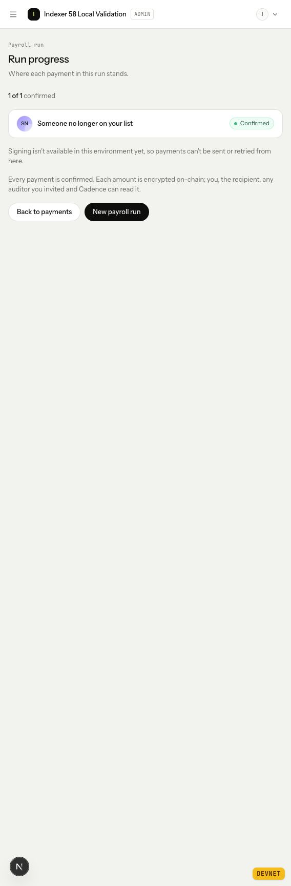

# Review validation

The code checked here is `aa25b79cc676bf1f5b7604a0ec8e2ba889a32c5d` in
the attached `proof-chain-status/cadence` worktree. Original checkout edits and
the user's original dashboard/proof processes were preserved.

Rust formatting, all-target compilation and Clippy with warnings denied passed.
Ten ordinary tests across indexer and the four payment HTTP suites passed; four
database tests in those suites stayed ignored. The indexer's disposable-database
test was separately executed against Supabase PostgreSQL 17.6 and passed, including
the new history and scheduling regressions. One targeted RPC unit test verified
HTTP throttling retries, the actual Retry-After delay, exhausted retries, long
cooldown rejection, credential-safe errors and ordinary RPC deadlines. The full
suite was not run. The existing vendored dependency deprecation warning remains.

The database regressions exercised a pruned entry outside preparation history,
page checkpoints across a later failure, catch-up after resume, a preparation
behind a previously completed cursor, and skipped transaction bodies outside
pending validity windows. A real mock WebSocket answered a ping and delivered a
verified receipt while a separate history request was still waiting and later
failed. Expired signatures were excluded from fast reads and subscriptions,
crossing the grace boundary unsubscribed without assigning a terminal status,
and the five-minute pass recovered old signed and unsigned landed transactions.
Permissions, event rollback/idempotency and startup readiness also passed.

Frontend type checking, targeted ESLint/Prettier and eight run-query tests passed.
The added cases cover an initial unavailable-service read with no cached run,
successful recovery, and permanent 401/403/404 errors that stop periodic reads.

The checkpoint migration was applied to the existing isolated local Supabase
stack on port 58622. The updated executable started on port 3003 using the
existing devnet fixtures. A temporary loopback forwarder recorded only public
RPC method/status/timing metadata, forwarding to the previously configured live
provider. Initial startup without the retry fix hit HTTP 429 on the seventh block
header read. The final build retried real 429 responses and reached readiness;
the retained [trace](review-rpc.jsonl) shows the same slot eventually succeeding.
The saved local CORS setting covered port 3000, so the temporary validation launch
used the previously chosen wildcard setting to allow the test dashboard on 3002.

The dashboard began with an initial connection error and no cached run. After
service startup it automatically changed to Confirmed, without reloading,
navigating or clicking Try again. The existing six payment events remained six
across recovery and restarts. The unresolved unsigned request stayed prepared.
These live checks reused previously executed devnet transactions; the earlier
report contains their chain receipts. Runtime provenance and the binary digest
are in [review-validation.json](review-validation.json).

